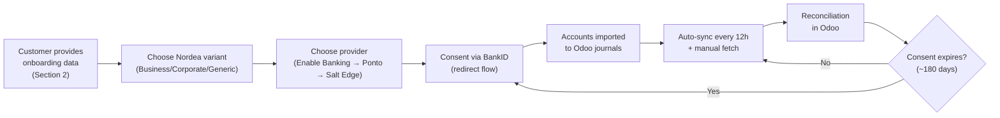

# Nordea Bank Sync Guide (Odoo 19 — Badno)

## Scope
This guide explains:
- Which Nordea option to choose in Odoo 19 (Norway) and why.
- Provider and account-type differences (Ponto / Enable Banking / Salt Edge).
- What customer information is required before onboarding.
- What Odoo capabilities are enabled after connection.
- Common pitfalls and troubleshooting steps.

No code push is required for this guide.

> [!IMPORTANT]
> **Prerequisite:** Bank synchronization requires a valid **Odoo Enterprise** subscription. The `account_online_synchronization` module is an Enterprise-only feature. The Odoo database must be registered with your Enterprise contract before you can connect any bank. Community Edition users cannot use this feature and must import bank statements manually (CSV, CAMT.053, OFX, etc.).

## Key Terms (Glossary)

If you are not familiar with banking integration terminology, here is a quick reference:

| Term | What it means |
|---|---|
| **PSD2** | Payment Services Directive 2 — a European regulation that requires banks to allow licensed third-party providers (like Odoo's providers) to securely read your bank transactions, with your explicit consent. Norway adopted PSD2 through implementation in 2019. |
| **SCA** | Strong Customer Authentication — a PSD2 requirement that mandates two or more independent authentication factors (something you know + something you have, e.g., password + BankID). Required when granting consent and at renewal. |
| **Consent** | Your explicit approval (given through the bank's own login page) that allows a provider to read your transaction data. See "Consent Lifecycle" section below for duration details. |
| **BankID** | Norway's standard digital identity solution used for online authentication. Nordea in Norway uses BankID (BankID Norge) as the SCA method when granting PSD2 consent. The customer must have an active BankID — either the mobile app version or the hardware token version. |
| **MFA** | Multi-Factor Authentication — the general term for extra security steps. In the Norwegian Nordea context, this is specifically **BankID**. |
| **Provider** | The technical middleman (aggregator) between Odoo and Nordea. Odoo routes connections through one of several providers: Enable Banking, Ponto (by Isabel Group), or Salt Edge. Each provider has different bank coverage, pricing, and connection behavior. You pick one during setup. |
| **Journal** | An Odoo accounting term — each bank account is mapped to a "journal" in Odoo, which is where imported transactions appear for reconciliation. One journal = one bank account. |
| **Reconciliation** | The process of matching imported bank transactions against invoices, bills, or other entries in Odoo to keep your books accurate. |
| **OdooFin Proxy** | Odoo's central proxy service (`production.odoofin.com`) that sits between your Odoo instance and the selected provider. It handles license verification, provider routing, and secure communication. Your Odoo instance never connects directly to Nordea or the provider — OdooFin handles all communication. |

## 1) How Odoo connects to Nordea

Odoo bank sync does not connect to Nordea via custom Badno code. It uses Odoo's built-in bank synchronization module, which routes through the OdooFin proxy:

```
Your Odoo Instance
    ↓ HTTPS
production.odoofin.com (OdooFin Proxy)
    ↓ (license check + routing)
Selected Provider (Enable Banking / Ponto / Salt Edge)
    ↓ PSD2 API
Nordea Bank APIs
```

**How it works in detail:**
1. Odoo sends a request to `production.odoofin.com`.
2. OdooFin verifies your Enterprise license is valid.
3. OdooFin routes the request to the provider you chose during setup.
4. The provider communicates with Nordea's PSD2-compliant APIs using the consent token the customer granted.
5. Transaction data flows back through the same chain into your Odoo journal.

> [!WARNING]
> **Firewall requirement:** If your Odoo instance is self-hosted (on-premise), your firewall/proxy must allow outbound HTTPS traffic to `https://production.odoofin.com/`. If this address is blocked, bank sync will silently fail with a connection error.

**Relevant code points in this repository:**
- `ee/addons/account_online_synchronization/models/account_journal.py`
- `ee/addons/account_online_synchronization/models/account_online.py`

## 2) What customer must provide (mandatory intake)

Collect **all** of the following before any connection attempt. Missing information will delay onboarding.

### 2.1 Company identity and banking channel
- Legal company name (as registered with Brønnøysund)
- Organization number (9-digit Norwegian org.nr.)
- Which Nordea channel they actively use for daily banking:
  - **Nordea Business** — for SMEs, individual entrepreneurs, up to ~250 employees. Uses the Nordea Business netbank/app.
  - **Nordea Corporate** — for medium-to-large companies. Uses the Nordea Corporate portal (advanced treasury, cash management, FX trading).
  - **Nordea First Card** — if they need corporate card statement sync (Mastercard-based expense management card, not a bank account).
  - **Unsure** — ask: "Which URL or app do you use to log in to your Nordea banking?"

### 2.2 Account inventory
- Full list of bank accounts to connect:
  - IBAN or Norwegian account number (11 digits, format: XXXX.XX.XXXXX)
  - Currency (NOK, EUR, USD, etc.)
  - Purpose (e.g., "main operating account", "tax account", "EUR payment account")
- Which Odoo journal each account should map to (developer should prepare these in advance)

### 2.3 Authorization — who will grant consent
- **Named person** who has rights to grant PSD2 consent for these accounts (not "the finance team")
- This person must:
  - Have an active **BankID** (mobile or hardware token) — this is the SCA method Nordea Norway uses
  - Have access to **all** the accounts listed above in their Nordea online banking profile
  - Be available during the onboarding session (consent must be granted in real-time via redirect)

> [!CAUTION]
> If the person granting consent cannot see all required accounts in their Nordea profile, those invisible accounts will **not** appear in Odoo after connection. Ensure the bank user has the correct access level in Nordea before starting.

### 2.4 Operational ownership (post-connection)
- **Consent renewal owner:** A named person responsible for re-authenticating when consent expires. Do **not** assign this to a shared mailbox — BankID is personal and requires an individual's device.
- **Finance owner (business side):** Person who will perform reconciliation in Odoo.
- **IT/Admin owner (technical side):** Person who will monitor sync logs, troubleshoot connection issues, and coordinate with Badno if problems arise.

## 3) What you get after connecting

Once Nordea is connected, Odoo can:
- **Import transactions** into the mapped Odoo journal automatically (every **12 hours** by default)
- **Manual fetch** at any time via `Accounting Dashboard > [Bank Journal] > Fetch Transactions`
- **Support reconciliation** — match transactions against invoices, bills, and manual entries
- **Show connection status** and warn via chatter/UI when consent renewal is approaching

### Automatic sync schedule
| Setting | Value |
|---|---|
| Default interval | Every 12 hours |
| Configurable? | Yes — via `Settings > Technical > Scheduled Actions > "Account: Journal online sync"` (requires Developer mode) |
| Available intervals | Every 4 hours, 12 hours, daily, weekly, bimonthly, monthly |
| Real-time? | No. Providers aggregate transactions in batches, so there is always some delay. |

### Historical transactions
On first connection, Odoo attempts to fetch as many past transactions as possible. However:
- Most providers limit historical data to approximately **3 months** (90 days) back.
- If you need older transactions, import them manually via `Accounting > Bank Statements > Import` (supports CAMT.053, CSV, OFX, QIF).
- You can control the import start date by setting `Accounting > Lock Dates > Lock Everything` to prevent fetching transactions before a specific date.

> [!NOTE]
> Our setup is **read-only bank sync**. Odoo will only *read* transactions from Nordea — it will **not** send payments or move money. Payment initiation is a separate Odoo module (`account_online_payment`) that we have **not** installed and is **not** in scope. All outgoing payments continue to be handled manually through Nordea's own banking portal.

## 4) Why does "Nordea" appear multiple times in Odoo?

### The core concept

Nordea is one bank, but it serves different customer segments through **separate portals and separate APIs**. Think of it as one building with three different entry doors:

| Entry door | Who uses it | What's behind it |
|---|---|---|
| 🚪 **Nordea Business** | Small and medium businesses (SMEs), entrepreneurs, up to ~250 employees | Company's day-to-day bank accounts (NOK, EUR, etc.) via the Business netbank/app |
| 🚪 **Nordea Corporate** | Larger companies — treasury, cash management, FX trading | All company accounts + advanced financial management tools via the Corporate portal |
| 🚪 **Nordea First Card** | Corporate card holders | Only Mastercard expense statements — **not** regular bank accounts |

Each door has its own **separate API endpoint** on the technical side. When Odoo connects to Nordea, it needs to know **which door to knock on** — because each door leads to a different set of accounts and data.

That's why the Odoo wizard shows 4 options when you search "Nordea":

```
"Nordea"            → General-purpose entry (when you're unsure which door)
"Nordea Business"   → Connects to the Business portal API
"Nordea Corporate"  → Connects to the Corporate portal API
"Nordea First Card" → Connects to the First Card API (card statements only)
```

### What happens if you pick the wrong one?

**Accounts won't appear.** This is the most common onboarding mistake.

Example: The customer uses Nordea **Business** for daily banking. Their accounts are registered under the Business endpoint. If you select "Nordea **Corporate**" in Odoo → Odoo connects to the Corporate API → the customer's accounts aren't there → **zero accounts are imported**.

It's like sending a letter to the right building but the wrong department — it won't arrive.

> [!CAUTION]
> **Always ask the customer:** "Which Nordea portal or app do you log in to for your daily banking?" — and choose accordingly. Never guess.

### Provider availability per Nordea option

Each Nordea option supports different providers. Here's what's typically available:

| Nordea option in wizard | Available providers (Norway) | Notes |
|---|---|---|
| **Nordea** (generic) | Salt Edge, Enable Banking, Ponto | Broadest provider support — useful as a fallback |
| **Nordea Business** | Ponto, Salt Edge | Enable Banking may not always be available for this option |
| **Nordea Corporate** | Salt Edge, Enable Banking | Good coverage for corporate treasury use cases |
| **Nordea First Card** | Enable Banking | Limited to one provider — if unavailable, use manual CSV import |

> [!TIP]
> Provider availability changes over time. Always check what the Odoo wizard actually shows at the time of onboarding. This table reflects observations as of 2026-02.

### How to identify which option the customer needs

| Customer says... | Select this in Odoo |
|---|---|
| "I log in at nordea.no/business" or "I use Nordea Bedrift" | **Nordea Business** |
| "I use Nordea Corporate" or "We have cash management / treasury" | **Nordea Corporate** |
| "We have Nordea First Card for employee expenses" | **Nordea First Card** |
| "I just use regular Nordea nettbank" (personal or simple business) | **Nordea** (generic) |
| Not sure which | Start with **Nordea** (generic) — if expected accounts don't appear, try Business or Corporate |

## 5) Provider selection

| Provider | Pricing | Advantages | Disadvantages | Best when |
|---|---|---|---|---|
| **Enable Banking** | Free (cost absorbed by Odoo/OdooFin) | Strong Nordic coverage, straightforward OAuth redirect, no separate registration needed | Not available for all institution-variant combinations; relatively newer provider | Nordic-focused connector — **recommended first choice** |
| **Ponto** (by Isabel Group) | **€4/month per bank account** (excl. VAT), billed directly by Isabel or bundled by Odoo | Mature aggregation platform, reliable for business accounts, good transaction detail | Paid — costs add up with multiple accounts; requires separate Ponto account consent | Enable Banking is not available for your Nordea variant |
| **Salt Edge** | Free via OdooFin (Odoo covers the cost) | Widest institution coverage globally (25,000+ banks), useful fallback | Connection quality varies per institution; behavior can be inconsistent across connectors; may require more re-authentication | Primary provider fails or is unavailable |

> [!IMPORTANT]
> **Provider pricing clarification:** When Odoo documentation says a provider is "free", it means Odoo does not charge you extra for using it — the cost is included in your Enterprise subscription. This does **not** mean the provider itself has no costs; Odoo covers those costs for you. The exception is Ponto, where you may be billed directly by Isabel Group at €4/month per account.

## 6) Which Nordea option should Badno select?

| Customer's banking reality | Recommended first choice | Provider preference | Fallback |
|---|---|---|---|
| Team logs in via Nordea Business portal | **Nordea Business** | Enable Banking → Ponto → Salt Edge | Nordea (generic) |
| Team uses corporate treasury / cash management | **Nordea Corporate** | Enable Banking → Salt Edge | Nordea Business |
| Need corporate card statement connectivity | **Nordea First Card** | Enable Banking | Manual CSV/file import if unavailable |
| Unclear or mixed setup | **Nordea** (generic) | Enable Banking → Salt Edge → Ponto | Test Business and Corporate separately |

**Decision rule:** Start with the exact channel the finance team uses for daily banking. Do not guess — ask the customer directly. If the wrong option is selected, the accounts may not appear or the consent flow may fail (see Section 4 — "What happens if you pick the wrong one?").

## 7) Consent lifecycle

Understanding consent is critical because a failed or expired consent means **all transaction sync stops**.

| Aspect | Detail |
|---|---|
| **How consent is granted** | Customer is redirected from Odoo to Nordea's login page, authenticates via BankID, and explicitly approves read access |
| **What consent covers** | Read-only access to account balances and transaction history for the selected accounts |
| **Duration (EU/EEA regulation)** | **Maximum 180 days** (6 months). Since July 25, 2023, the EU/EEA extended the PSD2 consent validity from 90 days to 180 days under the revised EBA Regulatory Technical Standards. Norway, as an EEA member, follows this regulation. |
| **What happens at expiry** | Odoo shows a "Consent expired" or "Reconnect" warning in the bank journal. All automatic sync stops. No data is lost — it simply pauses. |
| **How to renew** | Go to `Accounting > Banks > [Journal]` → click "Reconnect" or "Renew Consent" → customer re-authenticates with BankID |
| **Can it be revoked early?** | Yes. The customer can revoke consent at any time through Nordea's online banking or directly in Odoo. |

> [!WARNING]
> **Critical operational note:** The previous version of this document stated consent expires "every ~90 days". This was based on the original PSD2 regulation. As of **July 25, 2023**, the EBA extended the consent validity period to **180 days** for Account Information Services in the EU/EEA. However:
> - Some providers or banks may still enforce shorter periods (e.g., 90 days) at their discretion.
> - Nordea's own Open Banking documentation states a **180-day** maximum for AIS access tokens.
> - **Recommendation:** Set a calendar reminder at **150 days** (5 months) after each consent grant to allow buffer time for renewal.

## 8) Setup playbook

### Who does what

| Step | Developer (Badno) | Customer (finance/owner) |
|---|---|---|
| Before session | Create Odoo journals matching account list | Confirm Nordea channel + prepare BankID |
| During session | Guide variant and provider selection in wizard | Complete consent via BankID on Nordea redirect page |
| After connection | Verify journal mapping + check first sync logs | Verify all expected accounts appear |
| First week | Monitor sync logs daily, check for gaps | Test reconciliation with recent transactions |

### Step-by-step procedure

1. **Preparation (Developer):**
   - Create a journal in Odoo for each bank account: `Accounting > Configuration > Journals > New`
   - Set journal type to "Bank", assign the correct currency, and name it descriptively (e.g., "Nordea NOK Drift")

2. **Initiate connection (Customer, with developer guiding):**
   - Go to `Accounting > Dashboard` → click **"Add a Bank Account"**
   - Search for **"Nordea"** → select the correct variant (Business / Corporate / Generic / First Card)
   - A list of available providers appears → select the recommended provider (see Section 5)

3. **Grant consent (Customer):**
   - Odoo redirects to Nordea's authentication page
   - Customer logs in with BankID (the "redirect" flow)
   - Customer reviews and approves the list of accounts to share
   - After approval, browser redirects back to Odoo

4. **Map accounts to journals (Developer):**
   - Odoo displays the imported accounts
   - Map each imported account to the corresponding pre-created journal
   - If an expected account is missing, check: Did the BankID user have access to it in Nordea?

5. **Verify first sync (Developer):**
   - First transaction fetch should run immediately after connection
   - Check: Are transactions appearing? Is the balance correct? Any gaps?
   - Navigate to `Accounting > Configuration > Online Synchronization` (Developer mode) to inspect connection state

6. **Test reconciliation (Customer):**
   - Open the journal → click "Reconcile"
   - Match a few recent transactions against known invoices/bills
   - Confirm amounts and dates are correct

### Success criteria
- [ ] All expected accounts imported and mapped to journals
- [ ] Transactions appear — no missing gaps in the first 3 days of data
- [ ] Connection state shows "Connected" (not "Error" or "Expired")
- [ ] Customer can reconcile at least 5 transactions successfully
- [ ] Consent renewal date is documented and a calendar reminder is set

## 9) Safety note

Our integration is **read-only**. Odoo reads bank transactions — it does not and cannot send payments through this connection.

| Concern | Answer |
|---|---|
| Can Odoo move money from our Nordea account? | **No.** The PSD2 consent granted is for Account Information Services (AIS) only — read access to transactions and balances. |
| Is the payment initiation module installed? | **No.** The `account_online_payment` module is **not installed** and not in scope. |
| How are payments handled? | Payments continue to be created and approved manually through Nordea's own banking portal, as usual. |
| Is our data safe? | Transaction data flows encrypted (HTTPS) through the OdooFin proxy. Odoo does not store bank credentials — authentication is handled by Nordea via BankID redirect. |

## 10) Troubleshooting

| Symptom | Possible cause | Action |
|---|---|---|
| "No institutions found" when searching Nordea | Country not set to Norway in company settings | Verify `Settings > Companies > [Company] > Country = Norway` |
| Consent flow fails / redirect error | BankID not working, or wrong Nordea variant selected | Verify BankID works independently first; try a different variant |
| Some accounts missing after connection | BankID user does not have access to those accounts in Nordea | Ask customer to verify account visibility in Nordea netbank |
| Transactions stop syncing after some weeks | Consent expired | Renew consent via `Accounting > Banks > [Journal] > Reconnect` |
| "Connection error" in sync logs | Firewall blocking `production.odoofin.com` | Whitelist the domain in firewall rules |
| "Provider unavailable" | Selected provider has a temporary outage | Switch to fallback provider (see Section 6 fallback column) |
| Very old transactions missing | Provider limits historical data to ~3 months | Import older transactions manually via CSV/CAMT.053 |

## 11) Go-live checklist

1. [ ] Start with **one pilot journal** first — confirm sync works end-to-end before adding more accounts
2. [ ] Monitor sync logs and connection state **daily** during the first week
3. [ ] Keep a documented **fallback provider path** for each Nordea variant (see Section 6 table)
4. [ ] Assign a **consent renewal owner** (named person with BankID) and set a calendar reminder at **150 days** after consent grant
5. [ ] Ensure the Odoo scheduled action `"Account: Journal online sync"` is enabled and set to the desired interval
6. [ ] Verify **firewall rules** allow outbound HTTPS to `production.odoofin.com` (if self-hosted)
7. [ ] Document the provider and variant chosen for each journal in an internal config sheet
8. [ ] Train the finance team on how to reconcile transactions in Odoo

## 12) Onboarding diagram


## 13) FAQ

**Q: Does this work with Odoo Community Edition?**
A: No. Bank synchronization requires Odoo Enterprise. Community Edition users must import bank statements manually.

**Q: Can we connect multiple Nordea accounts?**
A: Yes. Each account becomes a separate journal in Odoo. You can connect as many accounts as the BankID user has access to.

**Q: What if the customer has accounts at multiple banks (not just Nordea)?**
A: Each bank is connected separately through the same Odoo wizard. The process is the same — search for the bank, select a provider, grant consent.

**Q: Will switching providers lose our historical data?**
A: No. Transactions already imported into Odoo journals are permanent. Switching providers only affects future data fetching. You may need to re-grant consent.

**Q: What happens if Odoo's OdooFin proxy goes down?**
A: Sync pauses until the service recovers. No data is lost. Previously imported transactions remain in Odoo. Check [Odoo Status](https://www.odoo.com/status) for service health.

## Sources

- Odoo 19 bank synchronization overview:
  - https://www.odoo.com/documentation/19.0/applications/finance/accounting/bank/bank_synchronization.html
- Odoo 19 Ponto provider documentation:
  - https://www.odoo.com/documentation/19.0/applications/finance/accounting/bank/bank_synchronization/ponto.html
- Odoo Enable Banking provider documentation:
  - https://www.odoo.com/documentation/17.0/applications/finance/accounting/bank/bank_synchronization/enablebanking.html
- Odoo Salt Edge provider documentation:
  - https://www.odoo.com/documentation/17.0/applications/finance/accounting/bank/bank_synchronization/saltedge.html
- PSD2 consent renewal extension (90 → 180 days, EBA RTS amendment, July 2023):
  - https://www.eba.europa.eu/regulation-and-policy/payment-services-and-electronic-money
- Nordea Open Banking API documentation (consent, authentication flows):
  - https://developer.nordeaopenbanking.com/
- Ponto by Isabel Group pricing:
  - https://www.myponto.com/en
- Enable Banking coverage:
  - https://enablebanking.com/coverage/
- Nordea BankID information (Norway):
  - https://www.nordea.no/privat/dagligbank/nettbank/bankid.html
- Nordea Business vs Corporate portals:
  - https://www.nordea.com/en/business
  - https://www.nordea.com/en/large-corporates-and-institutions
