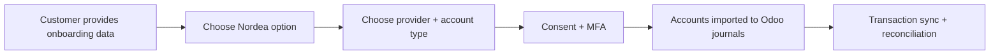

# Nordea Bank Sync Guide (Odoo 19 — Badno)

## Scope
This guide explains:
- Which Nordea option to choose in Odoo 19 (Norway) and why.
- Provider and account-type differences (Ponto / Enable Banking / Salt Edge).
- What customer information is required before onboarding.
- What Odoo capabilities are enabled after connection.

No code push is required for this guide.

## Key Terms (Glossary)

If you are not familiar with banking integration terminology, here is a quick reference:

| Term | What it means |
|---|---|
| **PSD2** | A European regulation (Payment Services Directive 2) that allows third-party services like Odoo to securely read your bank transactions — with your explicit permission. Think of it as the legal framework that makes bank sync possible. |
| **Consent** | Your one-time approval (given through the bank's own login page) that allows Odoo to read transactions. Consent typically expires after 90 days and needs to be renewed. |
| **MFA** | Multi-Factor Authentication — the extra security step your bank requires (e.g., BankID, SMS code, authenticator app) when granting consent. |
| **Provider** | The technical middleman between Odoo and Nordea. Odoo offers several providers (Ponto, Enable Banking, Salt Edge), each with slightly different coverage and pricing. You pick one during setup. |
| **Journal** | An Odoo accounting term — each bank account is mapped to a "journal" in Odoo, which is where imported transactions appear for reconciliation. |
| **Reconciliation** | The process of matching imported bank transactions against invoices, bills, or other entries in Odoo to keep your books accurate. |
| **OdooFin Proxy** | Odoo's central service that routes your bank connection through the selected provider. You never connect to Nordea directly — OdooFin handles the secure communication. |

## 1) How Odoo connects to Nordea
Odoo bank sync does not connect to Nordea via custom Badno code. It goes through Odoo Fin proxy:
- Odoo -> `production.odoofin.com` proxy
- Proxy -> selected provider (Ponto / Enable Banking / Salt Edge)
- Provider -> Nordea bank APIs

Relevant code points in this repository:
- `ee/addons/account_online_synchronization/models/account_journal.py`
- `ee/addons/account_online_synchronization/models/account_online.py`

## 2) What customer must provide (mandatory intake)
Collect this before any connection attempt.

1. Company identity and banking channel:
- Legal company name
- Organization number / VAT
- Which Nordea channel they actively use: Business / Corporate / First Card

2. Account inventory:
- Full list of bank accounts to connect (IBAN/account number, currency, purpose)
- Which account maps to which Odoo journal

3. Authorization:
- Bank user who has rights to grant PSD2 consent
- Required MFA device/app (e.g., BankID) ready during onboarding
- Confirmation that this user can see all required accounts

4. Operational ownership:
- Consent renewal owner (named person, not shared mailbox — expires every ~90 days)
- Finance owner (business) and IT/admin owner (technical)

## 3) What you get after connecting

Once Nordea is connected, Odoo can:
- **Import transactions** into the mapped Odoo journal automatically
- **Continuously refresh** bank transactions on a schedule
- **Support reconciliation** — match transactions against invoices and bills
- **Show connection status** and remind you when consent renewal is needed

> [!NOTE]
> Our setup is **read-only bank sync**. Odoo will only *read* transactions from Nordea — it will not send payments or move money. Payment initiation is a separate Odoo module (`account_online_payment`) that we have not implemented and is not in scope.

## 4) Option matrix: Nordea variant vs provider

| Nordea option in wizard | Available providers (OdooFin NO) | Typical use case |
|---|---|---|
| Nordea | Salt Edge, Enable Banking, Ponto | Generic access when team does not require dedicated business/corporate endpoint |
| Nordea Business | Ponto, Salt Edge | SME / business portal usage |
| Nordea Corporate | Salt Edge, Enable Banking | Corporate treasury / cash management |
| Nordea First Card | Enable Banking | Corporate card statement flow |

> [!TIP]
> Provider availability can change. Always confirm what is shown in the Odoo wizard at onboarding time.

## 5) Provider selection

| Provider | Advantages | Disadvantages | Best when |
|---|---|---|---|
| Enable Banking | Strong Nordic coverage, straightforward setup, free | Availability depends on institution-account combination | Nordic-focused connector with low friction (recommended first) |
| Ponto | Mature business banking aggregation | Often paid (4 EUR/month observed) | Enable Banking is not available for your variant |
| Salt Edge | Wide institution coverage, useful fallback | Behavior can vary across connectors | Primary provider fails or is unavailable |

## 6) Which Nordea option should Badno select?

| Customer banking reality | Recommended first choice | Fallback |
|---|---|---|
| Team logs in via Nordea Business portal | Nordea Business | Nordea (generic) |
| Team uses corporate treasury/cash management | Nordea Corporate | Nordea Business |
| Need card statement connectivity | Nordea First Card | File import if unavailable |
| Unclear or mixed setup | Nordea (generic) | Test Business and Corporate separately |

Start with the exact channel finance uses daily, not with a generic guess.

## 7) Setup playbook

**Who does what:**

| Developer (you) | Customer (finance/owner) |
|---|---|
| Prepare Odoo journals beforehand | Confirm which Nordea channel they use |
| Advise on variant and provider selection | Complete consent via BankID/MFA |
| Verify journal mapping after connection | Verify all expected accounts appear |
| Monitor sync logs during first week | Test reconciliation with recent transactions |

**Steps:**
1. Developer creates journals in Odoo matching the customer's account list.
2. Customer opens `Accounting > Banks` → "Add a Bank Account".
3. Customer searches "Nordea" and selects the correct variant.
4. Customer selects provider (prefer Enable Banking if available).
5. Customer is redirected to Nordea — completes consent with BankID.
6. Imported accounts are mapped to prepared journals.
7. First transaction fetch runs — developer verifies no gaps.

**Success criteria:**
- All expected accounts imported
- No missing transaction gaps in first 3 days
- Consent state remains connected

## 8) Safety note
Our integration is **read-only**. Odoo reads bank transactions — it does not and cannot send payments through this connection. The payment initiation module (`account_online_payment`) is not installed and is not part of our scope. Payments continue to be handled manually through Nordea's own banking portal as usual.

## 9) Go-live checklist
1. Use one pilot journal first, then scale to remaining accounts.
2. Monitor sync logs and connection state daily during the first week.
3. Keep a documented fallback provider path per Nordea option.
4. Define a consent renewal owner — consent expires every ~90 days.

## 10) Onboarding diagram

## Sources
- Odoo 19 bank synchronization:
  - https://www.odoo.com/documentation/19.0/applications/finance/accounting/bank/bank_synchronization.html
- Odoo 19 Ponto:
  - https://www.odoo.com/documentation/19.0/applications/finance/accounting/bank/bank_synchronization/ponto.html
- Odoo Enable Banking (provider reference):
  - https://www.odoo.com/documentation/17.0/applications/finance/accounting/bank/bank_synchronization/enablebanking.html
- Odoo Salt Edge (provider reference):
  - https://www.odoo.com/documentation/17.0/applications/finance/accounting/bank/bank_synchronization/saltedge.html
