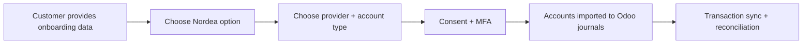
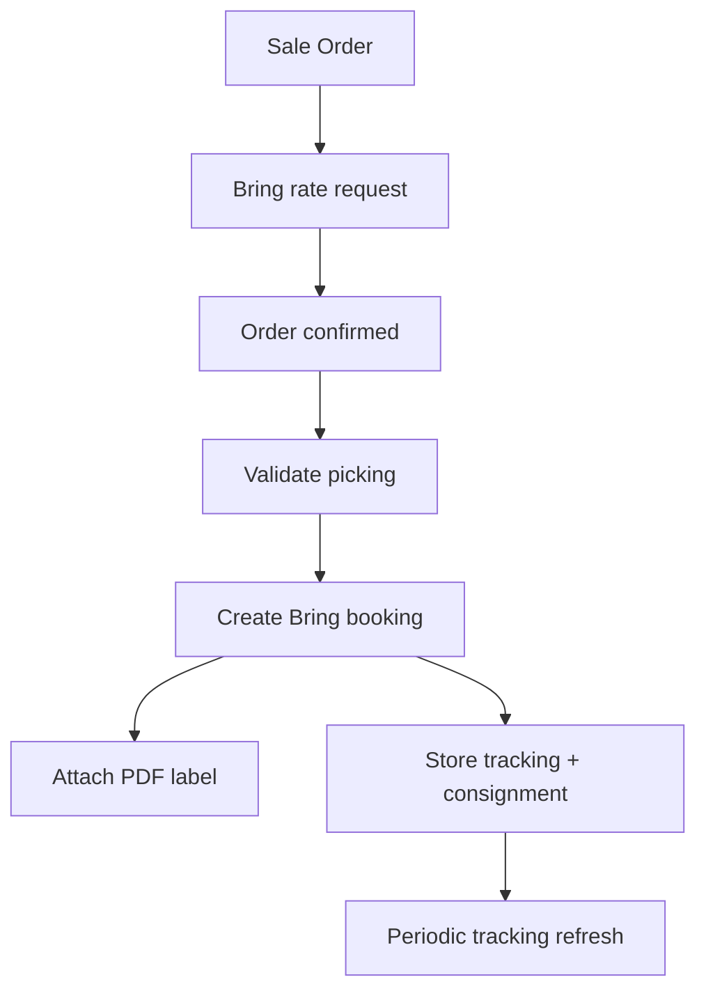

# Nordea (Odoo 19) + Bring Integration Guide (Badno)

## Scope
This guide explains:
- Which Nordea option to choose in Odoo 19 (Norway) and why.
- Provider and account-type differences (Ponto / Enable Banking / Salt Edge).
- What customer information is required before onboarding.
- Which Odoo capabilities are enabled after connection.
- Safety rules (can Odoo accidentally send payments to Nordea?).
- Bring integration setup and operations with practical runbooks.

No code push is required for this guide.

## Key Terms (Glossary)

If you are not familiar with banking integration terminology, here is a quick reference:

| Term | What it means |
|---|---|
| **PSD2** | A European regulation (Payment Services Directive 2) that allows third-party services like Odoo to securely read your bank transactions — with your explicit permission. Think of it as the legal framework that makes bank sync possible. |
| **Consent** | Your one-time approval (given through the bank's own login page) that allows Odoo to read transactions. Consent typically expires after 90 days and needs to be renewed. |
| **MFA** | Multi-Factor Authentication — the extra security step your bank requires (e.g., BankID, SMS code, authenticator app) when granting consent. |
| **Provider** | The technical middleman between Odoo and Nordea. Odoo offers several providers (Ponto, Enable Banking, Salt Edge), each with slightly different coverage and pricing. You pick one during setup. |
| **Journal** | An Odoo accounting term — each bank account is mapped to a "journal" in Odoo, which is where imported transactions appear for reconciliation. |
| **Reconciliation** | The process of matching imported bank transactions against invoices, bills, or other entries in Odoo to keep your books accurate. |
| **OdooFin Proxy** | Odoo's central service that routes your bank connection through the selected provider. You never connect to Nordea directly — OdooFin handles the secure communication. |

## As-of Snapshot (Nordea options)
As of **2026-02-11**, OdooFin NO institution list includes:
- Nordea
- Nordea Business
- Nordea Corporate
- Nordea First Card

Data source used for snapshot:
- `https://production.odoofin.com/proxy/v2/get_dashboard_institutions?country=NO&limit=300`

Observed in your Odoo UI screenshots (same date):
- Nordea First Card: `Enablebanking (Free)`, account type shown as `Business`.
- Nordea Corporate: `Saltedge (Free)` and `Enablebanking (Free)`, account type shown as `Business`.
- Nordea Business: `Ponto (4EUR/Month)` shown; account type radio shows `Business`, `Personal`, `Corporate`.
- Nordea: `Ponto (4EUR/Month)` and `Enablebanking (Free)` shown; account type radio shows `Business`, `Personal`, `Corporate`.

Important: provider availability and pricing labels can differ by country, tenant plan, and current OdooFin routing. Always confirm in the wizard at onboarding time.

## 1) Nordea in Odoo 19

### 1.1 How Odoo connects
Odoo bank sync does not connect to Nordea via custom Badno code. It goes through Odoo Fin proxy:
- Odoo -> `production.odoofin.com` proxy
- Proxy -> selected provider (Ponto / Enable Banking / Salt Edge)
- Provider -> Nordea bank APIs

Relevant code points in this repository:
- `ee/addons/account_online_synchronization/models/account_journal.py`
- `ee/addons/account_online_synchronization/models/account_online.py`

### 1.2 What customer must provide (mandatory intake)
Collect this before any connection attempt.

1. Company identity and legal scope:
- Legal company name
- Organization number / VAT
- Country of legal entity (NO)
- Which Nordea channel they actively use: Personal / Business / Corporate / First Card

2. Banking scope and account inventory:
- Full list of bank accounts to connect (IBAN/account number, currency, purpose)
- Which account maps to which Odoo journal
- Whether card statements (First Card) are in scope

3. Authorization and access:
- Bank user who has rights to grant PSD2 consent
- Required MFA device/app ready during onboarding
- Confirmation that this user can see all required accounts

4. Sync policy decisions:
- Read-only bank synchronization only, or payment initiation also
- If payments are in scope: who is allowed to initiate/sign
- Consent owner email for renewal reminders

5. Operational ownership:
- Finance owner (business)
- IT/admin owner (technical)
- Incident owner for failed sync/reconnect cases

### 1.3 What you get after connecting

Once Nordea is connected, Odoo can:
- **Import transactions** into the mapped Odoo journal automatically
- **Continuously refresh** bank transactions on a schedule
- **Support reconciliation** — match transactions against invoices and bills
- **Show connection status** and remind you when consent renewal is needed

> [!NOTE]
> Our setup is **read-only bank sync**. Odoo will only *read* transactions from Nordea — it will not send payments or move money. Payment initiation is a separate Odoo module (`account_online_payment`) that we have not implemented and is not in scope.

### 1.4 Option matrix: Nordea variant vs provider vs account type

| Nordea option in wizard | Providers observed in OdooFin NO | Providers observed in your screenshots | Account type options seen in your screenshots | Typical use case |
|---|---|---|---|---|
| Nordea | Salt Edge, Enable Banking, Ponto | Enablebanking, Ponto | Business / Personal / Corporate | Generic Nordea access when team does not require dedicated business/corporate endpoint |
| Nordea Business | Ponto, Salt Edge | Ponto | Business / Personal / Corporate | SME/business portal usage |
| Nordea Corporate | Salt Edge, Enable Banking | Saltedge, Enablebanking | Business | Corporate treasury/cash management setup |
| Nordea First Card | Enable Banking | Enablebanking | Business | Corporate card statement flow |

Notes:
- OdooFin API is the authoritative backend inventory for provider availability.
- UI can show a subset based on tenant, provider routing rules, and licensing conditions.

### 1.5 Provider selection: advantages and disadvantages

| Provider | Advantages | Disadvantages | Best when |
|---|---|---|---|
| Ponto | Mature business banking aggregation; strong Odoo documentation path for payment use cases | Often paid, may add monthly/provider fees | You need stable business flow and potentially payment-related capabilities |
| Enable Banking | Strong Nordic coverage and usually straightforward setup | Availability depends on institution-account combination | You prefer Nordic-focused connector with low friction |
| Salt Edge | Wide institution coverage and useful fallback route | Behavior can vary across specific institution connectors | Primary provider fails or not available for chosen institution/account type |

### 1.6 Which Nordea option should Badno select?
Use this decision matrix:

| Customer banking reality | Recommended first choice | Fallback |
|---|---|---|
| Team logs in via Nordea Business portal | Nordea Business | Nordea (if provider/account-type compatibility is better) |
| Team uses corporate treasury/cash management rights | Nordea Corporate | Nordea Business (only if account visibility is equivalent) |
| Need card statement connectivity (First Card) | Nordea First Card | None practical; use file import if unavailable |
| Unclear banking channel or mixed setup | Nordea | Then test Nordea Business and Nordea Corporate separately |

For Badno, start with the exact channel finance uses daily, not with a generic guess.

### 1.7 Selection-specific implementation playbooks

#### Playbook A: Nordea Business (recommended first for Badno if SME portal is used)
Required inputs:
- Business portal user with full account visibility
- MFA-ready approver
- Account-to-journal mapping sheet

Steps:
1. Connect Nordea Business in Odoo wizard.
2. Choose available provider (prefer lower-friction option shown in your tenant).
3. Select intended account type in wizard.
4. Complete consent and verify imported accounts.
5. Run first transaction fetch and reconcile sample days.

Success criteria:
- All expected accounts imported
- No missing transaction gaps in first 3 days
- Consent state remains connected

#### Playbook B: Nordea Corporate
Required inputs:
- Corporate netbank user with treasury rights
- Confirmation of account scope for each company/journal

Steps:
1. Connect Nordea Corporate.
2. Compare Salt Edge vs Enable Banking availability in wizard.
3. Choose provider and complete consent.
4. Validate that all treasury-relevant accounts appear.

Success criteria:
- Treasury accounts present and updating
- No repeated reconnect loop

#### Playbook C: Nordea First Card
Required inputs:
- First Card admin user
- Expected card statement scope

Steps:
1. Connect Nordea First Card (Enable Banking in current snapshot).
2. Complete consent and verify statement import behavior.
3. Map card statement destination journal.

Success criteria:
- Card transactions import correctly
- Reconciliation flow is operational

### 1.8 Safety note
Our integration is **read-only**. Odoo reads bank transactions — it does not and cannot send payments through this connection. The payment initiation module (`account_online_payment`) is not installed and is not part of our scope. Payments continue to be handled manually through Nordea's own banking portal as usual.

### 1.9 Go-live checklist
Apply these controls before go-live:
1. Use one pilot journal first, then scale to remaining accounts.
2. Monitor sync logs and connection state daily during the first week.
3. Keep a documented fallback provider path per Nordea option.
4. Define a consent renewal owner (a named person, not a shared mailbox) — consent expires every ~90 days.

### 1.10 Nordea onboarding diagram

## 2) Bring Guide (Badno)

### 2.1 What your Bring module currently does
From repository implementation:
- Fetch shipping rates (`shippingguide`)
- Create booking (`booking`)
- Attach label PDF to picking
- Save consignment and tracking URL
- Tracking refresh support
- Cancellation API is not supported in current flow

Relevant files:
- `custom_addons/delivery_carrier_bring/models/delivery_carrier.py`
- `custom_addons/delivery_carrier_bring/models/bring_api_client.py`
- `custom_addons/delivery_carrier_bring/doc/USER_GUIDE.md`

### 2.2 Required setup
- Bring API User ID
- Bring API Key
- Bring Customer Number (required for booking/pricing)
- Correct warehouse sender address
- Product weights on sellable products

If customer number is missing, booking is blocked by validation.

### 2.3 Test -> Production strategy
1. Start with Bring `test_mode=true` and one pilot delivery method.
2. Validate rate response, booking, label attachment, and tracking link.
3. Switch pilot method to production credentials.
4. Add additional Bring services only after pilot is stable.

### 2.4 Bring operations flow

### 2.5 Bring operational risks + controls
| Risk | Impact | Control |
|---|---|---|
| Missing customer number | Booking fails | Mandatory preflight check before go-live |
| Bad sender/receiver address | Rate/booking errors | Address quality validation in sales flow |
| Missing weight | Wrong/no rate | Product data completeness checks |
| API throttling / transient failures | Delay in label creation | Retry strategy + queue visibility |
| Service code change by Bring | Booking fails for specific product | Quarterly service code review |

## 3) Recommended rollout plan (Nordea + Bring)

1. Nordea phase
- Collect intake data using section 1.2 checklist.
- Start with one Nordea option matching real banking channel.
- Validate 3 days of transaction import and reconciliation quality.

2. Bring phase
- Pilot with one service and one warehouse.
- Validate end-to-end label/tracking in live-like transactions.

3. Stabilization phase
- Set monitoring checklist (daily in first 2 weeks):
  - sync status,
  - failed jobs,
  - missing transactions,
  - consent renewal status,
  - Bring booking failures.

## 4) Quick answers for stakeholder communication

- Can Nordea connection alone send payments from Odoo?
  - No, not by default.
  - Payment initiation requires explicit additional flow and user actions.

- What must customer provide before onboarding?
  - Legal entity data, account inventory, authorized bank user, MFA readiness, sync/payment policy, and ownership contacts.

- How do we choose between Corporate / Business / Personal options?
  - Choose the option that matches the real banking channel and user rights at Nordea.
  - Validate account visibility first; then optimize provider selection.

## Sources
- Odoo 19 bank synchronization:
  - https://www.odoo.com/documentation/19.0/applications/finance/accounting/bank/bank_synchronization.html
- Odoo 19 Ponto:
  - https://www.odoo.com/documentation/19.0/applications/finance/accounting/bank/bank_synchronization/ponto.html
- Odoo Enable Banking page (provider reference):
  - https://www.odoo.com/documentation/17.0/applications/finance/accounting/bank/bank_synchronization/enablebanking.html
- Odoo Salt Edge page (provider reference):
  - https://www.odoo.com/documentation/17.0/applications/finance/accounting/bank/bank_synchronization/saltedge.html
- OdooFin institutions API snapshot (NO):
  - https://production.odoofin.com/proxy/v2/get_dashboard_institutions?country=NO&limit=300
- Bring API docs:
  - https://developer.bring.com/
  - https://developer.bring.com/api/booking/
- Nordea business channels:
  - https://www.nordea.no/bedrift/vare-produkter/nettbank-og-konto/
  - https://www.nordea.com/no/node/1049

## Appendix: provider combinations seen in OdooFin NO snapshot (2026-02-11)
- Nordea: Salt Edge, Enable Banking, Ponto
- Nordea Business: Ponto, Salt Edge
- Nordea Corporate: Salt Edge, Enable Banking
- Nordea First Card: Enable Banking
