# Brightpearl Automation Rules

## [BP-01] Zero stock to Main

| Field | Value |
| :--- | :--- |
| **Rule Name** | [BP-01] Zero stock to Main |
| **Trigger** | Sales Order |
| **Trigger Details** | Sales orders will be checked once they are visible in Brightpearl, or after the status is updated, as follows: every 30 minutes for the first 24 hours, then every 12 hours for the rest of the first month, then every 24 hours for the next 5 months. |
| **Conditions** | **Order warehouse** Is **Zero Stock warehouse** |
| **Actions** | **Update warehouse** to **Main warehouse**<br>_(Unchecked: Do not update the order warehouse if stock is already allocated from original warehouse)_ |
| **Scheduling** | **Reactive**<br>By default, Automation will check new orders for changes reactively - every 30 minutes for the first 24 hours from the creation time, then every 12 hours for a month, then daily for five more months. |
| **Additional Options** | - [x] Set a new status if any actions fail? -> **Automatiseringsfeil**<br>- [x] Include errors in order notes |

### Flow Diagram
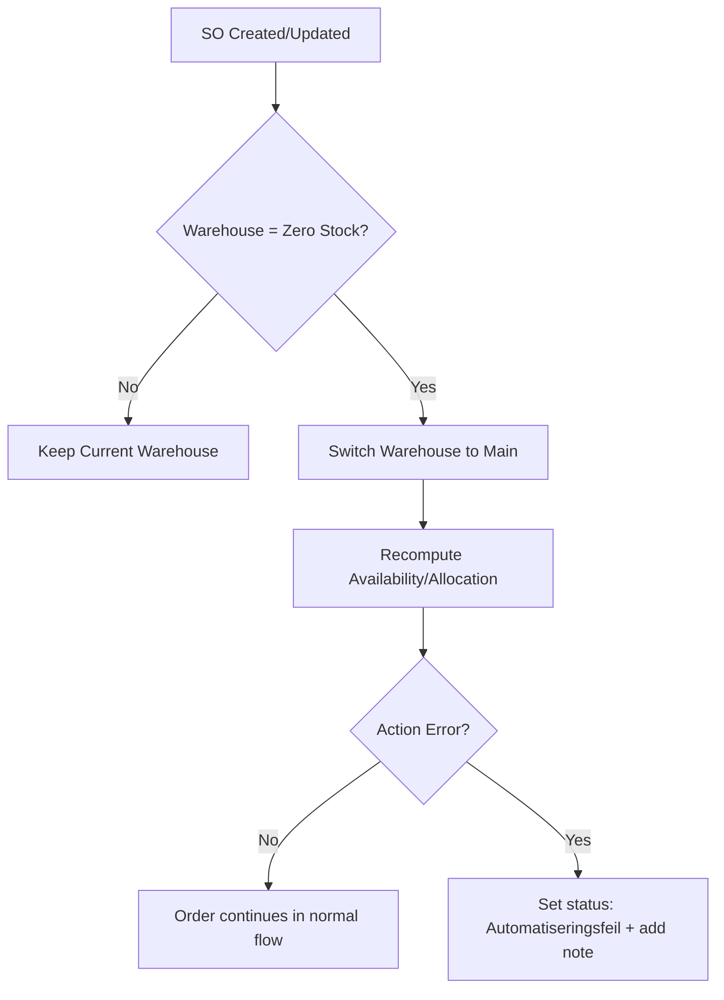

<br>

## [BP-02] Has comments

| Field | Value |
| :--- | :--- |
| **Rule Name** | [BP-02] Has comments |
| **Trigger** | Sales Order |
| **Trigger Details** | Sales orders will be checked once they are visible in Brightpearl, or after the status is updated, as follows: every 30 minutes for the first 24 hours, then every 12 hours for the rest of the first month, then every 24 hours for the next 5 months. |
| **Conditions** | **Custom field** (Comments) **Is not** **Empty** |
| **Actions** | **Update status** to **Med kundekommentar** |
| **Scheduling** | **Reactive**<br>By default, Automation will check new orders for changes reactively - every 30 minutes for the first 24 hours from the creation time, then every 12 hours for a month, then daily for five more months. |
| **Additional Options** | - [x] Set a new status if any actions fail? -> **Automatiseringsfeil**<br>- [x] Include errors in order notes |

### Flow Diagram
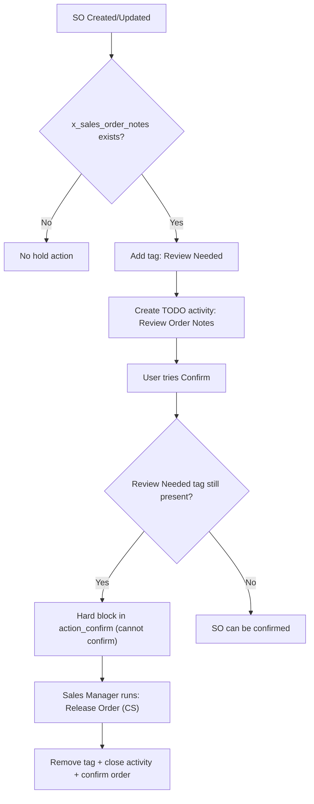

<br>

## [BP-03] Auto Allocate

| Field | Value |
| :--- | :--- |
| **Rule Name** | [BP-03] Auto Allocate |
| **Trigger** | Sales Order |
| **Trigger Details** | Sales orders will be checked once they are visible in Brightpearl, or after the status is updated, as follows: every 30 minutes for the first 24 hours, then every 12 hours for the rest of the first month, then every 24 hours for the next 5 months. |
| **Conditions** | - **Channel** Is **bad.no(shopify)**<br>- **Order warehouse** Is **Main Warehouse**<br>- **Order status** Is not **Kansellert, Kreditert/Erstatning/Reklamasjon, Pristilbud sendt, På vent, Utkast / Pristilbud**<br>- **Fulfilment status** Is not **All fulfilled** |
| **Actions** | - **Allocate stock**<br>- **Use partial allocation**: Yes<br>- **Use alternative warehouse**: No |
| **Scheduling** | **Reactive**<br>By default, Automation will check new orders for changes reactively - every 30 minutes for the first 24 hours from the creation time, then every 12 hours for a month, then daily for five more months. |
| **Additional Options** | - [x] Set a new status if any actions fail? -> **Automatiseringsfeil**<br>- [x] Include errors in order notes |

### Flow Diagram
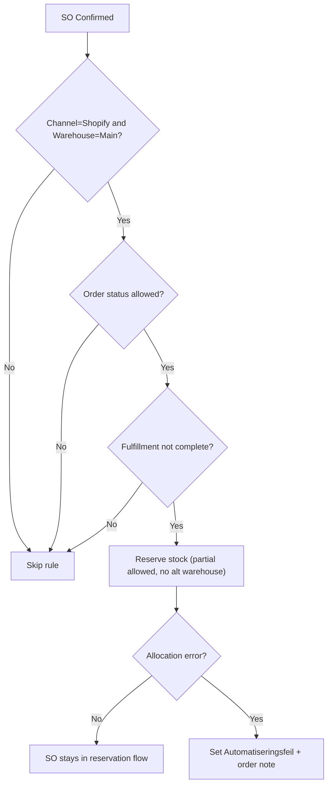

<br>

## [BP-04] Allocate after PO receipt

| Field | Value |
| :--- | :--- |
| **Rule Name** | [BP-04] Allocate after PO receipt |
| **Trigger** | Receiving goods |
| **Trigger Details** | Sales orders will be checked when goods are received in Brightpearl (either through Purchase Orders or Sales Credits being created). |
| **Conditions** | - **Stock allocation status** Is **No Stock Allocated, Stock Partially Allocated**<br>- **Order status** Is not **Fakturert, Kansellert, Kreditert/Erstatning/Reklamasjon, Pristilbud sendt, På vent, Utkast / Pristilbud**<br>- **Channel** Is not **Shopify POS, Shopify POS Bergen** |
| **Actions** | - **Allocate stock**<br>- **Use partial allocation**: Yes<br>- **Use alternative warehouse**: No |
| **Scheduling** | N/A (Triggered by Receiving Goods) |
| **Additional Options** | - [ ] Set a new status if any actions fail? (Unchecked)<br>- [x] Include errors in order notes |

### Flow Diagram
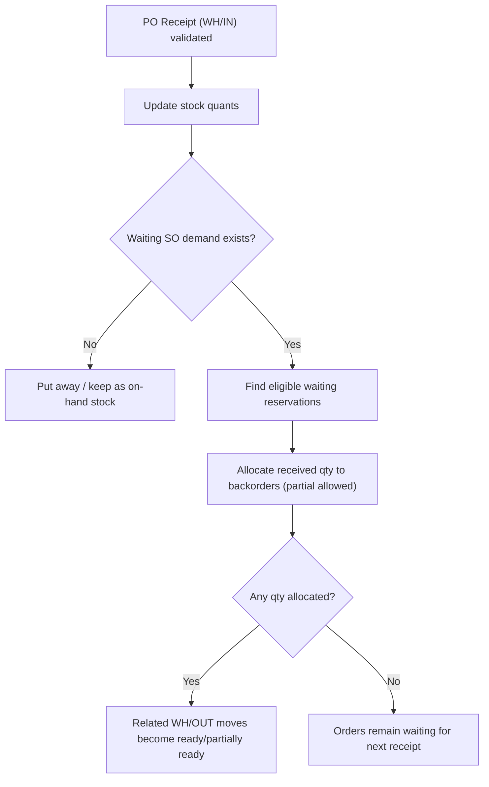

<br>

## [BP-05] Auto Fulfil

| Field | Value |
| :--- | :--- |
| **Rule Name** | [BP-05] Auto Fulfil |
| **Trigger** | Sales Order |
| **Trigger Details** | Sales orders will be checked once they are visible in Brightpearl, or after the status is updated, as follows: every 30 minutes for the first 24 hours, then every 12 hours for the rest of the first month, then every 24 hours for the next 5 months. |
| **Conditions** | - **Channel** Is **Bad.no (Shopify)**<br>- **Order status** Is not **Kansellert, Kreditert/Erstatning/Reklamasjon, Pristilbud sendt, På vent, Utkast / Pristilbud**<br>- **Payment status** Is **Partially Paid, Fully Paid, Authorized**<br>- **Stock allocation status** Is **Partially Allocated, Fully Allocated**<br>- **Shipping method** Is not **nettlager** |
| **Actions** | - **Fulfill order**<br>- **Partial fulfil**: No<br>- **Use alternative warehouse**: No<br>- **Update status** to **Reservert & Oppfylt** |
| **Scheduling** | **Reactive**<br>By default, Automation will check new orders for changes reactively - every 30 minutes for the first 24 hours from the creation time, then every 12 hours for a month, then daily for five more months. |
| **Additional Options** | - [x] Set a new status if any actions fail? -> **Automatiseringsfeil**<br>- [x] Include errors in order notes |

### Flow Diagram
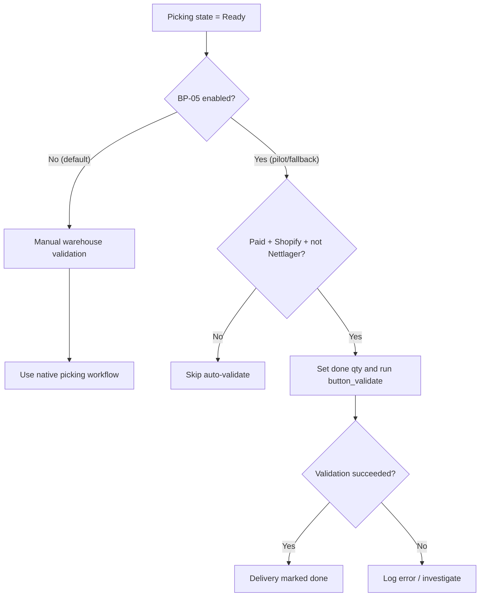

<br>

## [BP-06] Bestilles manuelt

| Field | Value |
| :--- | :--- |
| **Rule Name** | [BP-06] Bestilles manuelt |
| **Trigger** | Sales Order |
| **Trigger Details** | Sales orders will be checked once they are visible in Brightpearl, or after the status is updated, as follows: every 30 minutes for the first 24 hours, then every 12 hours for the rest of the first month, then every 24 hours for the next 5 months. |
| **Conditions** | - **Order status** Is **Ny ordre til godkjenning**<br>- **Product Automation Category** Is **Montering, Metervare-desimal, Maltilpasset, Valgfri-farge**<br>_(Unchecked: Require all rows to meet this condition)_ |
| **Actions** | **Update status** to **Bestilles manuelt** |
| **Scheduling** | **Reactive**<br>By default, Automation will check new orders for changes reactively - every 30 minutes for the first 24 hours from the creation time, then every 12 hours for a month, then daily for five more months. |
| **Additional Options** | - [x] Set a new status if any actions fail? -> **Automatiseringsfeil**<br>- [x] Include errors in order notes |

### Flow Diagram
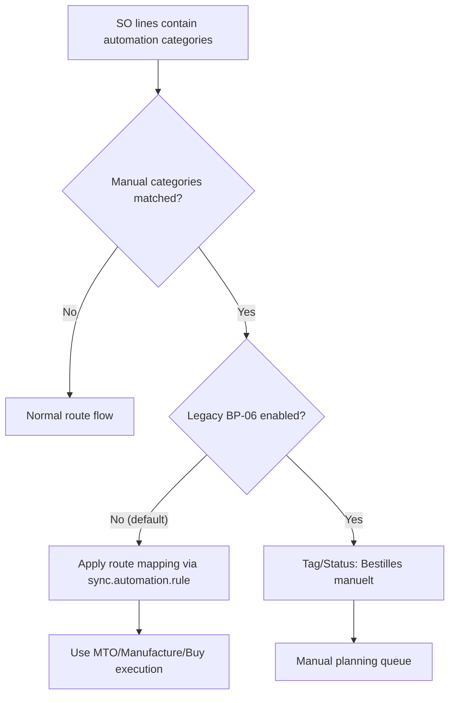

<br>

## [BP-07] Authorized Quote

| Field | Value |
| :--- | :--- |
| **Rule Name** | [BP-07] Authorized Quote |
| **Trigger** | Sales Order |
| **Trigger Details** | Sales orders will be checked once they are visible in Brightpearl, or after the status is updated, as follows: every 30 minutes for the first 24 hours, then every 12 hours for the rest of the first month, then every 24 hours for the next 5 months. |
| **Conditions** | - **Order status** Is **Pristilbud sendt**<br>- **Payment status** Is **Fully Paid, Authorized** |
| **Actions** | **Update status** to **Ny ordre til godkjenning** |
| **Scheduling** | **Reactive**<br>By default, Automation will check new orders for changes reactively - every 30 minutes for the first 24 hours from the creation time, then every 12 hours for a month, then daily for five more months. |
| **Additional Options** | - [x] Set a new status if any actions fail? -> **Automatiseringsfeil**<br>- [x] Include errors in order notes |

### Flow Diagram
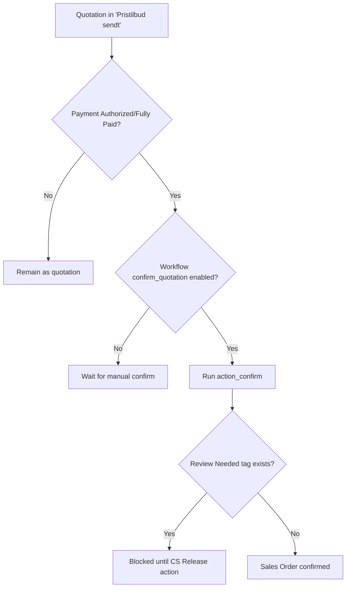

<br>

## [BP-08] Allierbygget - Ny ordre til godkjenning

| Field | Value |
| :--- | :--- |
| **Rule Name** | [BP-08] Allierbygget - Ny ordre til godkjenning |
| **Trigger** | Sales Order |
| **Trigger Details** | Sales orders will be checked once they are visible in Brightpearl, or after the status is updated, as follows: every 30 minutes for the first 24 hours, then every 12 hours for the rest of the first month, then every 24 hours for the next 5 months. |
| **Conditions** | - **Shipping method** Is **Allierbygget (Bergen)**<br>- **Order status** Is **Ny ordre til godkjenning**<br>- **Fulfilment status** Is **Not fulfilled, Part fulfilled** |
| **Actions** | **Update status** to **Bestilt til lager** |
| **Scheduling** | **Reactive**<br>By default, Automation will check new orders for changes reactively - every 30 minutes for the first 24 hours from the creation time, then every 12 hours for a month, then daily for five more months. |
| **Additional Options** | - [x] Set a new status if any actions fail? -> **Automatiseringsfeil**<br>- [x] Include errors in order notes |

### Flow Diagram
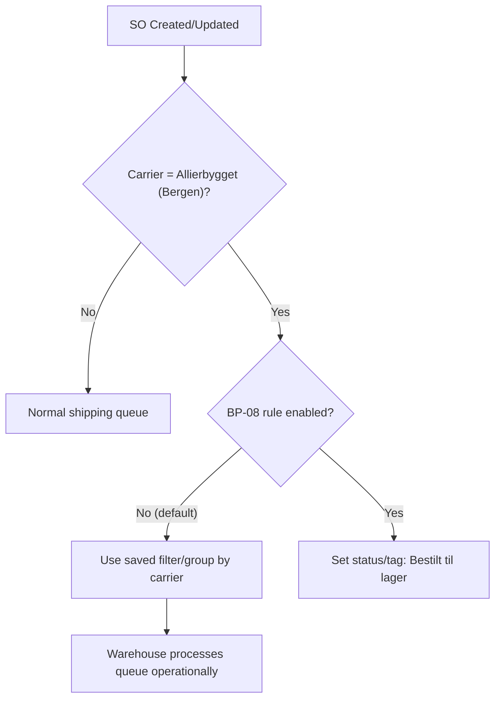

<br>

## [BP-09] Dropship Auto

| Field | Value |
| :--- | :--- |
| **Rule Name** | [BP-09] Dropship Auto |
| **Trigger** | Sales Order |
| **Trigger Details** | Sales orders will be checked once they are visible in Brightpearl, or after the status is updated, as follows: every 30 minutes for the first 24 hours, then every 12 hours for the rest of the first month, then every 24 hours for the next 5 months. |
| **Conditions** | - **Product Automation Category** Is **Dropship-Auto**<br>_(Unchecked: Require all rows to meet this condition)_<br>- **Shipping method** Is not **Allierbygget (Bergen), Nettlager**<br>- **Order status** Is **Ny ordre til godkjenning**<br>- **Fulfilment status** Is not **All fulfilled, Non stock-tracked**<br>- **Payment status** Is **Partially Paid, Fully Paid, Authorized** |
| **Actions** | **Advanced fulfilment**<br> - **Product Automation Category**: Dropship-Auto (PO ship to customer (drop-ship))<br> - **Purchase order options**: Primary Supplier, Status: Bestilt<br> - **Email supplier**: Yes (Subject: `Bad.no: Innkjøp Direkte Levering (PO)`, Template: `Bad.no: Innkjøp direkte levering (PO) _orderRef_`)<br> - **Update status** to **Ny ordre til godkjenning** |
| **Scheduling** | **Reactive**<br>By default, Automation will check new orders for changes reactively - every 30 minutes for the first 24 hours from the creation time, then every 12 hours for a month, then daily for five more months. |
| **Additional Options** | - [x] Set a new status if any actions fail? -> **Automatiseringsfeil**<br>- [x] Include errors in order notes |

### Flow Diagram
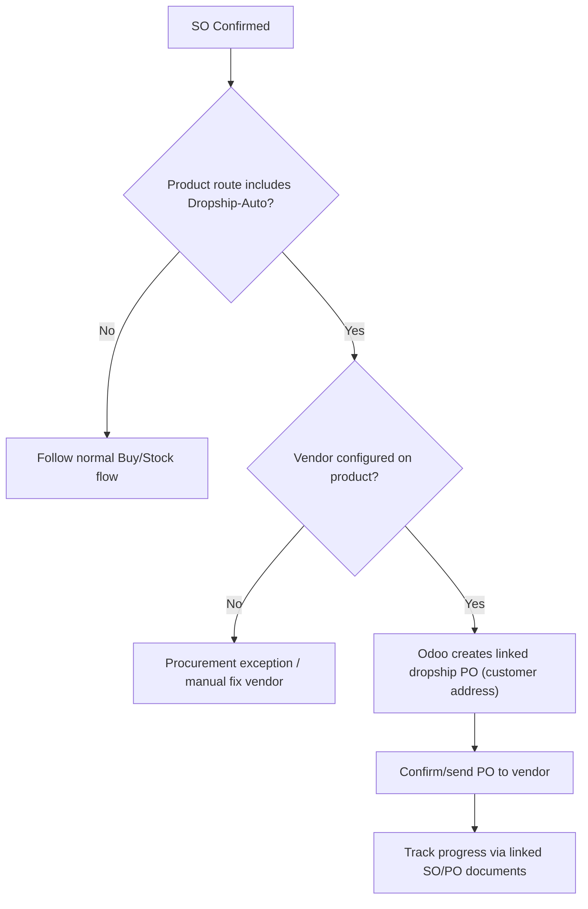

<br>

## [BP-10] Dropship Manuell

| Field | Value |
| :--- | :--- |
| **Rule Name** | [BP-10] Dropship Manuell |
| **Trigger** | Sales Order |
| **Trigger Details** | Sales orders will be checked once they are visible in Brightpearl, or after the status is updated, as follows: every 30 minutes for the first 24 hours, then every 12 hours for the rest of the first month, then every 24 hours for the next 5 months. |
| **Conditions** | - **Product Automation Category** Is **Dropship-Manuell**<br>- **Shipping method** Is not **Allierbygget (Bergen), Nettlager**<br>- **Order status** Is **Ny ordre til godkjenning**<br>- **Fulfilment status** Is not **All fulfilled, Non stock-tracked**<br>- **Payment status** Is **Partially Paid, Fully Paid, Authorized** |
| **Actions** | **Advanced fulfilment**<br> - **Product Automation Category**: Dropship-Manuell (PO ship to customer (drop-ship))<br> - **Purchase order options**: Primary Supplier, Status: Chuck Norris<br> - **Email supplier**: No<br> - **Update status** to **Ny ordre til godkjenning** |
| **Scheduling** | **Reactive**<br>By default, Automation will check new orders for changes reactively - every 30 minutes for the first 24 hours from the creation time, then every 12 hours for a month, then daily for five more months. |
| **Additional Options** | - [x] Set a new status if any actions fail? -> **Automatiseringsfeil**<br>- [x] Include errors in order notes |

### Flow Diagram
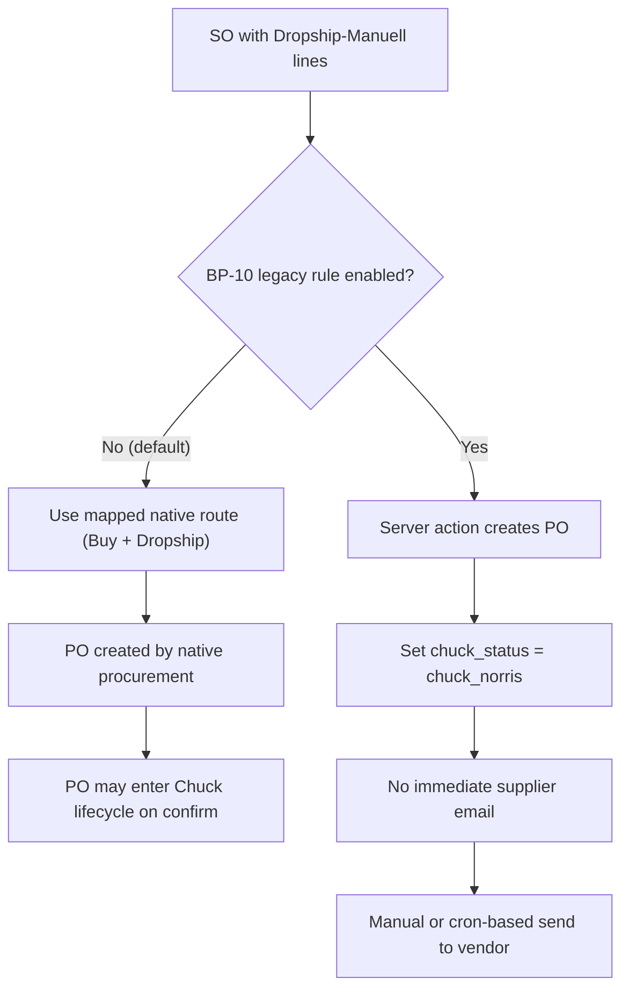

<br>

## [BP-11] Ny ordre til godkjenning til Direkte Levering

| Field | Value |
| :--- | :--- |
| **Rule Name** | [BP-11] Ny ordre til godkjenning til Direkte Levering |
| **Trigger** | Sales Order |
| **Trigger Details** | Sales orders will be checked once they are visible in Brightpearl, or after the status is updated, as follows: every 30 minutes for the first 24 hours, then every 12 hours for the rest of the first month, then every 24 hours for the next 5 months. |
| **Conditions** | - **Channel** Is **Bad.no (Shopify)**<br>- **Order status** Is **Ny ordre til godkjenning**<br>- **Fulfilment status** Is **All fulfilled**<br>- **Stock allocation status** Is **Stock Fully Allocated** |
| **Actions** | **Update status** to **Direkte levering - bestilt** |
| **Scheduling** | **Reactive**<br>By default, Automation will check new orders for changes reactively - every 30 minutes for the first 24 hours from the creation time, then every 12 hours for a month, then daily for five more months. |
| **Additional Options** | - [x] Set a new status if any actions fail? -> **Automatiseringsfeil**<br>- [ ] Include errors in order notes |

### Flow Diagram
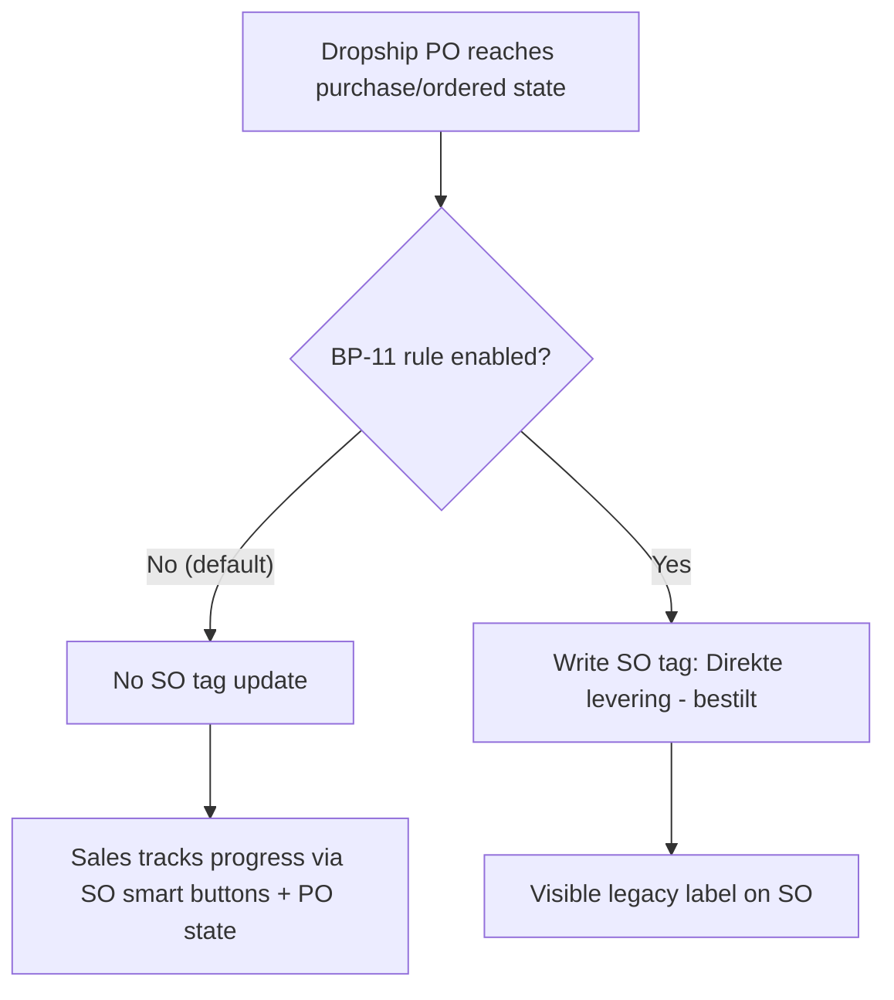

<br>

## [BP-12] Pakke til hentested under 1000,-

| Field | Value |
| :--- | :--- |
| **Rule Name** | [BP-12] Pakke til hentested under 1000,- |
| **Trigger** | Sales Order |
| **Trigger Details** | Sales orders will be checked once they are visible in Brightpearl, or after the status is updated, as follows: every 30 minutes for the first 24 hours, then every 12 hours for the rest of the first month, then every 24 hours for the next 5 months. |
| **Conditions** | - **Order status** Is **Ny ordre til godkjenning**<br>- **Channel** Is **Bad.no (Shopify)**<br>- **Payment status** Is **Partially Paid, Fully Paid, Authorized**<br>- **Shipping method** Is **Pakke til hentested**<br>- **Total value** Is less than **1000**<br>- **Fulfilment status** Is not **All fulfilled** |
| **Actions** | **Update status** to **Bestilt til lager** |
| **Scheduling** | **Reactive**<br>By default, Automation will check new orders for changes reactively - every 30 minutes for the first 24 hours from the creation time, then every 12 hours for a month, then daily for five more months. |
| **Additional Options** | - [x] Set a new status if any actions fail? -> **Automatiseringsfeil**<br>- [ ] Include errors in order notes |

### Flow Diagram
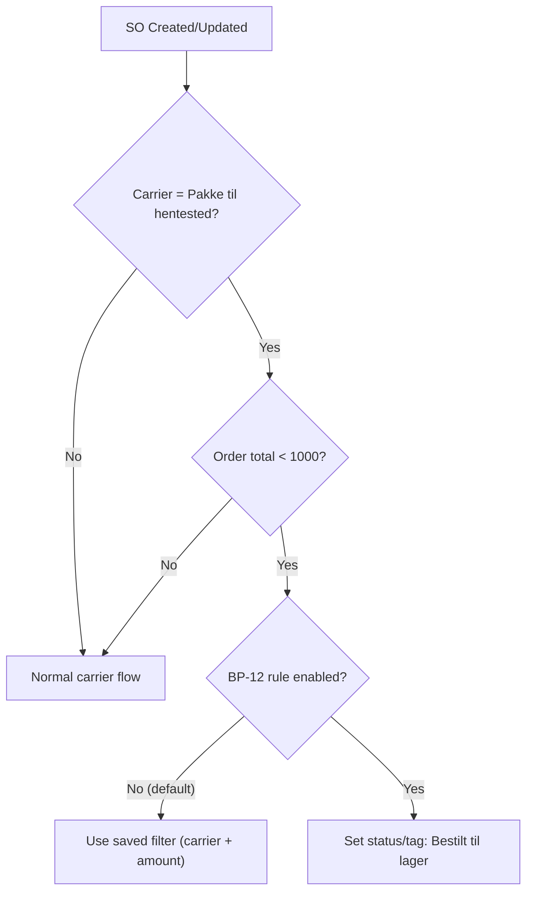

<br>

## [BP-13] Partially shipped

| Field | Value |
| :--- | :--- |
| **Rule Name** | [BP-13] Partially shipped |
| **Trigger** | Sales Order |
| **Trigger Details** | Sales orders will be checked once they are visible in Brightpearl, or after the status is updated, as follows: every 30 minutes for the first 24 hours, then every 12 hours for the rest of the first month, then every 24 hours for the next 5 months. |
| **Conditions** | - **Channel** Is **Bad.no (Shopify)**<br>- **Order status** Is not **Kansellert, Kreditert/Erstatning/Reklamasjon, På vent, Batch order - normal levering**<br>- **Order shipping status** Is **stock part shipped** |
| **Actions** | **Update status** to **Del-levert** |
| **Scheduling** | **Reactive**<br>By default, Automation will check new orders for changes reactively - every 30 minutes for the first 24 hours from the creation time, then every 12 hours for a month, then daily for five more months. |
| **Additional Options** | - [x] Set a new status if any actions fail? -> **Automatiseringsfeil**<br>- [x] Include errors in order notes |

### Flow Diagram
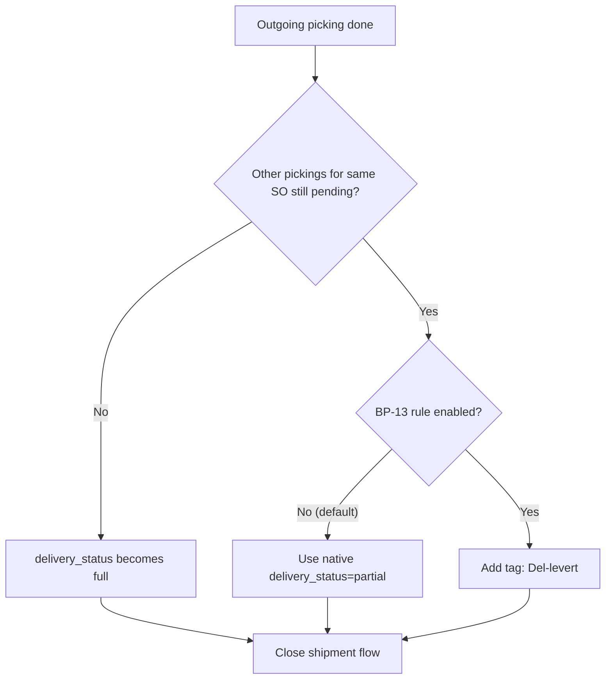

<br>

## [BP-14] Auto invoice

| Field | Value |
| :--- | :--- |
| **Rule Name** | [BP-14] Auto invoice |
| **Trigger** | Sales Order |
| **Trigger Details** | Sales orders will be checked once they are visible in Brightpearl, or after the status is updated, as follows: every 30 minutes for the first 24 hours, then every 12 hours for the rest of the first month, then every 24 hours for the next 5 months. |
| **Conditions** | - **Channel** Is **Bad.no (Shopify), Phone and email orders, Shopify POS, Shopify POS Bergen**<br>- **Order shipping status** Is **All stock shipped**<br>- **Order status** Is not **Pristilbud sendt, På vent, Utkast / Pristilbud, Kansellert, Kreditert/Erstatning/Reklamasjon**<br>- **Payment status** Is **Fully Paid** |
| **Actions** | - **Invoice order**<br>- **Email a PDF of the invoice to the customer**: Yes |
| **Scheduling** | **Reactive**<br>By default, Automation will check new orders for changes reactively - every 30 minutes for the first 24 hours from the creation time, then every 12 hours for a month, then daily for five more months. |
| **Additional Options** | - [x] Set a new status if any actions fail? -> **Automatiseringsfeil**<br>- [x] Include errors in order notes |

### Flow Diagram
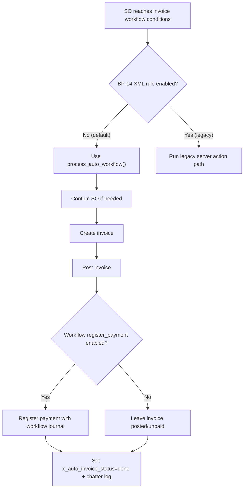

<br>

## [BP-15] Pakke i postkassen

| Field | Value |
| :--- | :--- |
| **Rule Name** | [BP-15] Pakke i postkassen |
| **Trigger** | Sales Order |
| **Trigger Details** | Sales orders will be checked once they are visible in Brightpearl, or after the status is updated, as follows: every 30 minutes for the first 24 hours, then every 12 hours for the rest of the first month, then every 24 hours for the next 5 months. |
| **Conditions** | - **Order status** Is **Ny ordre til godkjenning**<br>- **Channel** Is **Bad.no (Shopify)**<br>- **Payment status** Is **Partially Paid, Fully Paid, Authorized**<br>- **Shipping method** Is **Pakke i postkassen** |
| **Actions** | **Update status** to **Bestilt til lager** |
| **Scheduling** | **Reactive**<br>By default, Automation will check new orders for changes reactively - every 30 minutes for the first 24 hours from the creation time, then every 12 hours for a month, then daily for five more months. |
| **Additional Options** | - [x] Set a new status if any actions fail? -> **Automatiseringsfeil**<br>- [x] Include errors in order notes |

### Flow Diagram
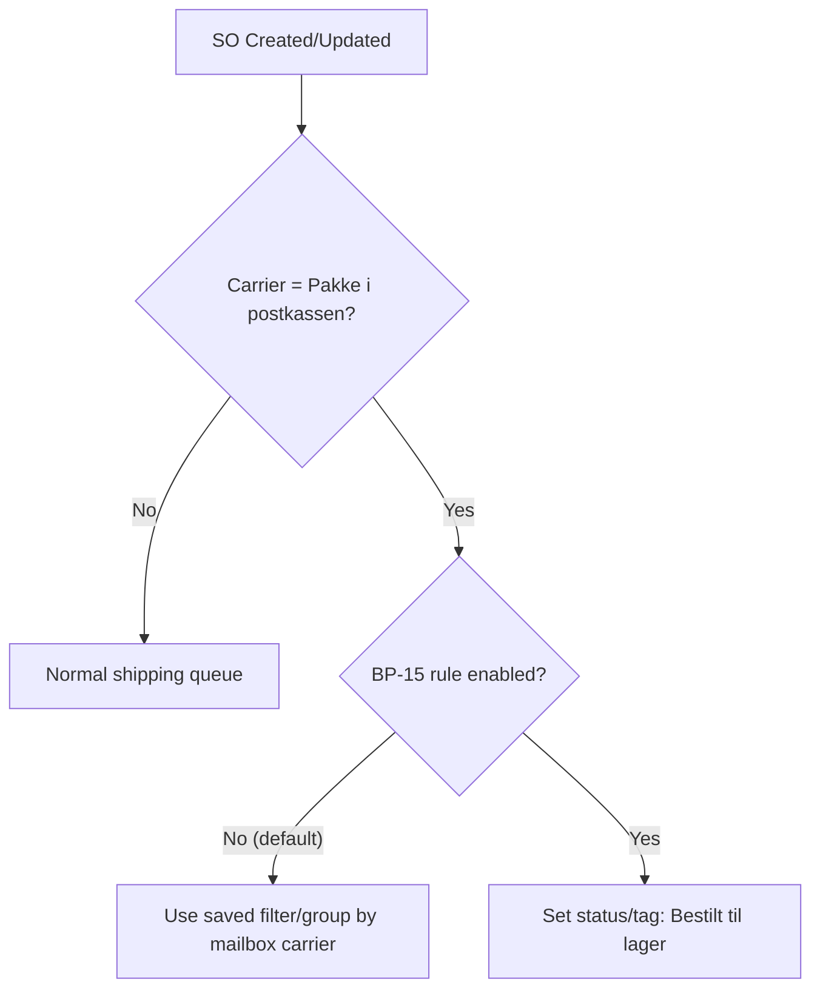

<br>

| Rule Name | Trigger | Conditions | Actions | Status | Odoo 19 Implementation Guide (Detailed) |
| :--- | :--- | :--- | :--- | :--- | :--- |
| **[BP-01] Zero stock to Main** | Sales Order | <ul><li>**Order warehouse** Is **Zero Stock warehouse**</li></ul> | <ul><li>**Update warehouse** to **Main warehouse**</li></ul> | ✅ **DONE** | **Native Odoo 19 (no custom rule):**<br>1. Configure warehouse resupply path (**Inventory > Configuration > Warehouses/Routes**) from Zero Stock to Main.<br>2. Keep pull rules active for internal replenishment.<br>3. Validate with a test SO on Zero Stock and check internal transfer chain.<br>**Why better:** route engine is deterministic and auditable without status tags. |
| **[BP-02] Has comments** | Sales Order | <ul><li>**Custom field** (Comments) **Is not** **Empty**</li></ul> | <ul><li>**Update status** to **Med kundekommentar**</li></ul> | ✅ **DONE** | **Active custom control (code-backed):**<br>1. `automation_rules.xml` rule `[BP-02] Hold Order` is active and tags order when `x_sales_order_notes` exists.<br>2. `sale_order.py` overrides `action_confirm` and hard-blocks confirm while `Review Needed` tag exists.<br>3. CS releases via server action `[BP-02] Release Order (CS)` (manager-only), which removes tag and confirms.<br>**Result:** stronger than BP because bypass via direct confirm is blocked in code. |
| **[BP-03] Auto Allocate** | Sales Order | <ul><li>**Channel** Is **bad.no(shopify)**</li><li>**Order warehouse** Is **Main Warehouse**</li><li>**Order status** Is not **Kansellert...**</li></ul> | <ul><li>**Allocate stock**</li></ul> | ✅ **DONE** | **Native reservation policy:**<br>1. Set Delivery Operation Type reservation to **At Confirmation**.<br>2. On SO confirm, Odoo reserves available stock automatically.<br>3. Use standard exceptions (`waiting`, `partially_available`) instead of custom statuses.<br>**Why better:** less race condition risk than timer-based BP checks. |
| **[BP-04] Allocate after PO receipt** | Receiving goods | <ul><li>**Stock allocation** Is **No/Partial**</li></ul> | <ul><li>**Allocate stock**</li></ul> | ✅ **DONE** | **Native inbound-driven reallocation:**<br>1. Receive PO (`WH/IN`) normally.<br>2. Odoo updates quants and automatically re-evaluates waiting outbound pickings/backorders.<br>3. Warehouse confirms backorder behavior via operation type settings.<br>**Why better:** single inventory engine handles both receipt and reservation consistency. |
| **[BP-05] Auto Fulfil** | Sales Order | <ul><li>**Payment** Is **Paid**</li><li>**Stock** Is **Allocated**</li></ul> | <ul><li>**Fulfill order**</li></ul> | 📦 **ARCHIVED** | **Current production stance: disabled by design.**<br>1. Rule exists in `automation_rules.xml` but `active=False`.<br>2. Primary flow is manual warehouse validation to avoid phantom shipping/compliance risk.<br>3. If needed, re-enable only for pilot scope and monitor chatter/logs + healthcheck query #8.<br>**Why better now:** controlled risk vs unconditional auto-validate. |
| **[BP-06] Bestilles manuelt** | Sales Order | <ul><li>**Automation Category** Is **Montering, Metervare...**</li></ul> | <ul><li>**Update status** to **Bestilles manuelt**</li></ul> | 📦 **ARCHIVED** | **Replaced by route-based execution model:**<br>1. Category-to-route mapping is managed by `sync.automation.rule` (+ default data in `sync_automation_rule_data.xml`).<br>2. Product routes are applied during sync in `product_template.py`.<br>3. Use MTO/Manufacture/Buy routes instead of manual status tags.<br>**Why better:** real procurement behavior is automated, not just visual tagging. |
| **[BP-07] Authorized Quote** | Sales Order | <ul><li>**Order status** Is **Pristilbud sendt**</li><li>**Payment** Is **Paid**</li></ul> | <ul><li>**Update status** to **Ny ordre til godkjenning**</li></ul> | ✅ **DONE** | **Handled through workflow + native confirm:**<br>1. `process_auto_workflow()` confirms quotation when workflow says `confirm_quotation=True`.<br>2. Payment/financial status comes from order webhook mapping.<br>3. If workflow not matched, native manual confirm remains available.<br>**Why better:** behavior is centrally configured in workflow, not duplicated in many automations. |
| **[BP-08] Allierbygget - Ny ordre...** | Sales Order | <ul><li>**Shipping** Is **Allierbygget (Bergen)**</li></ul> | <ul><li>**Update status** to **Bestilt til lager**</li></ul> | 📦 **ARCHIVED** | **Operationalized as views, not status mutation:**<br>1. Keep rule archived (`active=False`).<br>2. Create saved filters/grouping by `carrier_id` for warehouse queue management.<br>3. Re-enable tag rule only if business explicitly needs legacy label semantics.<br>**Why better:** avoids redundant status writes and keeps carrier truth in one field. |
| **[BP-09] Dropship Auto** | Sales Order | <ul><li>**Automation Category** Is **Dropship-Auto**</li></ul> | <ul><li>**Advanced fulfilment** (Dropship)</li></ul> | ✅ **DONE** | **Native dropship with enforced route mapping:**<br>1. `sync_automation_rule_data.xml` maps Dropship-Auto to Buy + Dropship + MTO routes.<br>2. Ensure vendor is set on product.<br>3. SO confirmation creates linked PO to customer destination via native dropship flow.<br>**Why better:** native traceability across SO/PO/picking without custom status orchestration. |
| **[BP-10] Dropship Manuell** | Sales Order | <ul><li>**Automation Category** Is **Dropship-Manuell**</li></ul> | <ul><li>**Create PO** (Chuck Norris status)</li></ul> | 📦 **ARCHIVED** | **Primary path switched to native/hybrid:**<br>1. BP-10 automation in `automation_rules.xml` is archived (`active=False`).<br>2. Dropship-Manuell route is mapped by `sync_automation_rule_data.xml` (Buy + Dropship).<br>3. PO-level Chuck lifecycle is handled in `chuck_integration` (`button_confirm`, `chuck_status`, cron auto-send) when enabled.<br>**Fallback:** BP-10 can be re-enabled only for controlled legacy parity. |
| **[BP-11] Ny ordre... Direkte Levering** | Sales Order | <ul><li>**Dropship PO** Is **Confirmed**</li></ul> | <ul><li>**Update status** to **Direkte levering...**</li></ul> | 📦 **ARCHIVED** | **Replaced by native relational visibility:**<br>1. Archived tag rule is not required for core flow.<br>2. Sales users follow PO progress from SO smart buttons/linked documents.<br>3. Chuck statuses (`ordered`, `ob_confirmed`, `delivered`, etc.) provide vendor lifecycle state on PO itself.<br>**Why better:** operational truth stays on PO lifecycle, not duplicated on SO tag. |
| **[BP-12] Pakke til hentested < 1000** | Sales Order | <ul><li>**Shipping** Is **Pickup** AND **< 1000**</li></ul> | <ul><li>**Update status** to **Bestilt til lager**</li></ul> | 📦 **ARCHIVED** | **Handled as operational filter:**<br>1. Keep archived rule disabled by default.<br>2. Build saved filter domain on SO list for pickup carrier + amount threshold.<br>3. Use dashboard/list views for queue actions instead of status-tag mutation.<br>**Why better:** cleaner data model and easier threshold changes without server action edits. |
| **[BP-13] Partially shipped** | Sales Order | <ul><li>**Shipping** Is **Partial**</li></ul> | <ul><li>**Update status** to **Del-levert**</li></ul> | 📦 **ARCHIVED** | **Use native delivery state:**<br>1. `delivery_status` on SO gives partial/full/no delivery state natively.<br>2. Archived tag automation remains fallback only.<br>3. Warehouse/service teams should filter by native `delivery_status` field in views/reports.<br>**Why better:** no duplicate logic between pickings and sales tags. |
| **[BP-14] Auto invoice** | Sales Order | <ul><li>**Shipped** AND **Paid**</li></ul> | <ul><li>**Invoice order**</li></ul> | 📦 **ARCHIVED** | **Moved to workflow engine + model logic:**<br>1. XML BP-14 automation is archived (`active=False`).<br>2. `process_auto_workflow()` handles confirm, invoice creation, posting, and payment registration based on workflow config.<br>3. Configure in SYNC workflow settings and verify `x_auto_invoice_status` + chatter logs.<br>**Why better:** one configurable engine for all channels instead of fragile per-rule code paths. |
| **[BP-15] Pakke i postkassen** | Sales Order | <ul><li>**Shipping** Is **Mailbox**</li></ul> | <ul><li>**Update status** to **Bestilt til lager**</li></ul> | 📦 **ARCHIVED** | **Handled as carrier-based operation queue:**<br>1. Keep archived rule disabled by default.<br>2. Use saved filter/group by `carrier_id` for mailbox shipments.<br>3. Re-enable legacy tag rule only if explicit reporting need cannot be met with native fields.<br>**Why better:** keeps shipping method as source of truth, avoids status inflation. |

---

# 🔎 Gap Analysis (Recommended Automations)

Based on Odoo 19 analysis, the following rules are missing or strongly recommended to close loops:

| Recommended Rule | Category | Priority | Description | Proposed Implementation |
| :--- | :--- | :--- | :--- | :--- |
| **[BP-GAP-01] High Value Hold** | Risk | 🔴 High | Auto-hold orders > 10,000 NOK or High Fraud Risk. | **Approval Rule** (Studio) or Automation adding "Review" Activity. |
| **[BP-GAP-02] Vendor Tracking Sync** | Dropship | 🟠 Medium | Get tracking numbers from Chuck Norris back to Shopify. | Email Parsing (Regular Expression) or API endpoint. |
| **[BP-GAP-03] Fiscal Position Map** | Accounting | 🟡 Low | Auto-map taxes for Sweden/Denmark orders. | **Fiscal Positions** (Native Odoo feature). |

---

# 🛠️ Technical Refactoring Report (Odoo 19)

The following rules have been analyzed for code quality and native feature parity.

### [BP-06] Bestilles manuelt (Refactored)
*   **Status:** ✅ Refactored logic exists, but automation is archived/inactive by default
*   **Old Logic (Brittle):** Relied on matching text `Category Name` (e.g., "Montering"). Renaming a category broke the rule.
*   **New Logic (Robust):** Now matches `x_automation_categ_ids.code` (e.g., `414`).
*   **Benefit:** Categories can be renamed freely in the Odoo UI without breaking automation.

### [BP-10] Dropship Manuell (Anti-Pattern Warning)
*   **Critique:** Currently uses a Custom Python Script to create Purchase Orders. This bypasses Odoo's native ecosystem (Routes, Incoterms, Address Sync).
*   **Recommendation:** Switch to Odoo's Native **Dropship Route**. Handle the "Chuck Norris" status via a separate automation on the *Purchase Order* model, not the Sales Order.

### [BP-13] Partially Shipped (Redundant)
*   **Critique:** Adds a custom tag `Del-levert`.
*   **Recommendation:** Odoo 19 has a native `delivery_status` field (`partial`, `full`) on the Sales Order. This automation should be retired in favor of the native field to improve performance.

---

# 🚨 Risk & Compliance Report

## ✅ Resolved Risks

| Risk | Status | Resolution |
| :--- | :--- | :--- |
| **Payment Capture on Partial Delivery** | ✅ Resolved | `stock_picking.py` now calculates exact shipped amount (`quantity * price_reduce_taxinc`). Captures only what is shipped, ensuring Norwegian Consumer Law compliance. |
| **Phantom Shipping (Instant Validation)** | ✅ Mitigated | `[BP-05]` rule set to `active="False"`. Warehouse must manually validate deliveries. |
| **Hardcoded Dropship Category** | ✅ Improved | Replaced with system parameter lookup: `ir.config_parameter('sync.dropship_category_name')`. |

## 🛡️ Existing Safety Mechanisms

*   **Review Needed Hard Block:** System blocks "Confirm" button if `tag_review_needed` is present.
*   **Idempotency:** Uses `x_shopify_order_id` and `identity_key` to prevent duplicate processing.

---

# 🚀 Transition Guide: Custom Scripts → Native Features

## Strategy: "Native First"

> 📘 **Detailed Guide:** For step-by-step configuration and test scenarios, please refer to the **[Odoo Native Transition Guide](Odoo_Native_Transition_Guide.md)**.

| Feature | Old Way (Custom Script) | New Way (Odoo 19) | Benefit |
| :--- | :--- | :--- | :--- |
| **Dropshipping** | Python creates POs | **Native Dropship Route** | Odoo handles updates, returns, links. |
| **Auto-Invoicing** | Python creates & posts | OCA `sale_automatic_workflow` | Configurable, standardized. |
| **Tagging Rules** | Python `record.write()` | **Automated Actions (No Code)** | Functional consultants can maintain. |

## Implementation Steps

### Phase A: Dropshipping (Critical)
1.  Go to **Purchase > Configuration > Settings** → Enable **Dropshipping**.
2.  Configure **Product Category** ("Dropship-Manuell") → Check ✅ **Dropship** route.
3.  Ensure products have a **Vendor** set.
4.  Odoo will auto-create RFQ on SO confirmation.
5.  Use simple Automated Action on **Purchase Order** to auto-confirm if needed.

### Phase B: Auto-Invoicing (Consolidated)
*   **Action:** Deactivated legacy `[BP-14]` automation rule.
*   **New System:** Use **Sale Auto Workflow** (Native Model).
*   **Why:** We merged the custom logic (Chatter logging, Shopify status tracking) into the standard workflow model to have a single, unified configuration point.
*   **Config:** Go to **Side Menu > Sale Auto Workflow**.


---

# 📚 Recommended OCA Modules

| Module | Purpose |
| :--- | :--- |
| `sale_automatic_workflow` | Auto-Confirm, Auto-Invoice, Auto-Email |
| `stock_picking_batch` | Mass validate deliveries (Native) |
| `account_invoice_start_end_dates` | Subscription start/end dates |

---

# 📋 Workflow Summary Table

| Trigger | Condition | Action | Source |
| :--- | :--- | :--- | :--- |
| New Order / Update | `x_sales_order_notes` != False | Tag: "Review Needed" | `automation_rules.xml` |
| SO Confirm | Category == "Dropship-Manuell" | Optional: Create PO (Chuck Norris) only if BP-10 is re-enabled | `automation_rules.xml` (BP-10, Disabled) |
| SO Confirm | Paid or Authorized | Auto-Confirm Order | `sale_order.py` |
| Delivery Ready | Paid + Shopify + Stock | Auto-Validate Delivery | `automation_rules.xml` (BP-05, Disabled) |
| Delivery Done | Source = Shopify | Trigger Payment Capture | `stock_picking.py` |
| Delivery Done | Source = Shopify | Sync Fulfillment to Shopify | `stock_picking.py` |

---

# 📝 Requirements Backlog (From Discovery)

The following requirements were identified during discovery but are not yet implemented as automation rules:

## 🔴 High Priority (Custom Development Required)

| ID | Requirement | Description | Effort | Status |
| :--- | :--- | :--- | :--- | :--- |
| **REQ-13** | Fulfillment Method Algorithm | Automatically decide: Dropship vs Warehouse based on stock, cost, ETA. | 24-30h | ❌ Not Started |
| **REQ-19** | KID Payment Reconciliation | Auto-mark non-Shopify orders as Paid when KID payment received. | 10-12h | ❌ Not Started |
| **REQ-20** | CDON Auto-Paid | Mark orders from CDON channel as Paid automatically. | 60-80h | ❌ Not Started |
| **REQ-25** | Partial Fulfillment by Supplier ETA | Split backorders by supplier estimated arrival date. | 12-16h | ❌ Not Started |
| **REQ-26** | Split/Hold by Cost & Lead Time | Rule engine to hold or split orders based on shipping cost, lead time. | 16-20h | ❌ Not Started |
| **REQ-28** | Drop-ship Lowest Cost Vendor | Auto-select vendor with lowest total cost (product + shipping). | 16-20h | ❌ Not Started |
| **REQ-T2-04** | Stock Sync (2-Way) Webhooks | Push stock changes to SYNC immediately via webhook. | TBD | ⏸️ On Hold |
| **REQ-T2-08** | CDON Marketplace Integration | Auto-confirm & Payment logic for CDON orders. | 2-3d | ❌ Not Started |
| **REQ-T2-09** | Payment Capture (Norwegian Law) | Custom partial capture logic for Stripe/Nets. | 1-2d | ❌ Not Started |
| **REQ-T2-11** | Vendor Communication (Email) | Automate email sending for non-API vendors. | Partial | ⚠️ Partial |

## 🟡 Medium Priority (Configuration + Light Customization)

| ID | Requirement | Description | Effort | Status |
| :--- | :--- | :--- | :--- | :--- |
| **REQ-17** | Requested Delivery Date (EDD) | Add custom field for customer-requested delivery date + reporting. | 2h | ❌ Not Started |
| **REQ-16** | Track Shipped Qty Per Line | Track shipped quantity per SO line (mostly native, needs view). | 8h | ❌ Not Started |
| **REQ-21** | Shopify 2-Way Sync (Orders) | Update Odoo when Shopify order is updated (cancel, address change). | 5h | ⏳ Partial |
| **REQ-22** | Shopify 2-Way Sync (Customers) | Update Odoo customer when Shopify customer is updated. | 5h | ⏳ Partial |

## ✅ Already Implemented / Native

| ID | Requirement | Description | Status |
| :--- | :--- | :--- | :--- |
| **REQ-01** | Hold Orders with Comments | → **[BP-02]** | ✅ Done |
| **REQ-03** | Auto Generate Picking | Native Odoo (SO Confirm → Delivery Order) | ✅ Native |
| **REQ-05** | Auto Invoice After Packing | → **[BP-14]** | ✅ Done |
| **REQ-06** | Auto Email Invoice | → **[BP-14]** (Email step) | ✅ Done |
| **REQ-11** | Push Shopify Orders to ERP | `sync_shopify_integration` webhook | ✅ Done |
| **REQ-12** | Push Shopify Customers to ERP | `sync_shopify_integration` webhook | ✅ Done |
| **REQ-23** | Estimated Delivery Date Algorithm | Native Odoo Inventory (Lead Times) | ✅ Native |
| **REQ-24** | FIFO Restocking | Native Odoo Inventory (Removal Strategy) | ✅ Native |

---

# 🦕 Legacy Architecture Analysis: Chuck Norris vs. Odoo 19

## Overview
"Chuck Norris" is a legacy Python orchestration layer located in `~/chuck-norris/` that manages EDI (FTP/CSV) integrations with vendors (Ahlsell, Heidenreich, etc.).
In Odoo 19, this external "Middleman" architecture is considered an **Anti-Pattern**. Odoo 19 + OCA best practices dictate that integrations should live **inside Odoo** as modules, or use Odoo's native API capabilities, rather than relying on brittle external scripts triggered by "magic statuses".

## 🛑 Why Deprecate Chuck Norris?
| Feature | Chuck Norris (Legacy) | Odoo 19 (Modern) | Risk of Legacy |
| :--- | :--- | :--- | :--- |
| **Trigger** | Checks for specific Integer Status IDs (e.g., `24`) | **Automated Actions** / **Webhooks** | "Magic Numbers" break easily. |
| **Logic** | Hardcoded in `controll.py` | Configurable **Routes** & **Rules** | Logic is hidden from Odoo users. |
| **Maintenance** | Requires SSH / Linux Admin skills | Managed via Odoo UI / Modules | specialized knowledge bottleneck. |
| **Visibility** | Logs in text files (`/logs`) | **Chatter** / **Odoo Logging** | Failures are silent to sales staff. |

## 🛠️ Modernization Roadmap

### Phase 1: Logic Migration (Immediate)
**Goal:** Stop "Chuck Norris" from making business decisions.
1.  **Dropship Routing:**
    *   **Old Way:** `[BP-10]` sets status "Chuck Norris", script finds it, creates PO.
    *   **New Way:** Configure **Dropship Route** on products. Odoo auto-creates the PO.
2.  **Status Updates:**
    *   **Old Way:** Script updates Odoo status to "Ordered".
    *   **New Way:** Odoo native status flows (RFQ -> Purchase Order -> Locked).

### Phase 2: Transport Migration (Short-Term)
**Goal:** Keep Chuck Norris ONLY for moving files (Dumb Pipe), not logic.
1.  **Move Scripts:** Refactor `trans.py` (FTP upload/download) script logic into an Odoo Module cron job.
    *   *Implementation:* Use Python's `ftplib` or `paramiko` directly within an Odoo Scheduled Action.
2.  **Remove Orchestrator:** Delete `orchestrator.py` and trigger syncs via Odoo Crons: `ir.cron`.

### Phase 3: Full Native (Long-Term)
**Goal:** Use standard Odoo/OCA tools.
1.  **EDI Backend:** Install OCA `edi` module.
2.  **Configuration:** Configure Vendor FTP details in Odoo UI.
3.  **Mapping:** Use QWeb templates or Python mapping in Odoo to generate vendor CSVs.

## ⚠️ Specific Chuck Norris Modules Reform
Based on `TECHNICAL_DEBT_ANALYSIS.md`:

| Module | Action Required |
| :--- | :--- |
| **Heidenreich** | 🔴 **CRITICAL.** Logic relies on `status == 24`. **Migrate to Odoo Dropship Route immediately.** |
| **Tapwell** | Hardcoded logic `shipping='37'`. **Replace with Delivery Carrier mapping table in Odoo.** |
| **Sanipro** | Hardcoded absolute paths. **Move logic to Odoo Addon.** |

## 🏁 Conclusion
**Do not expand Chuck Norris.** All new features must be built inside Odoo. existing Chuck Norris scripts should be systematically cannibalized and replaced by Odoo native features or Odoo modules.

---

# 🔬 Deep Dive: Heidenreich Purchase Logic (1:1 Parity Guide)

The "Chuck Purchase Module" for Heidenreich is essentially a **NELFO 4.0 Text File Generator** combined with an **SFTP Uploader**.
To replace this in Odoo 19 with exact parity, we must replicate the file generation format precisely.

## 1. The "Black Box" Decoded (Current Behavior)
Currently, `chuck-norris/integration/Heidenreich/nelfo.py` does the following:
1.  **Trigger:** Finds Purchase Orders with status `chuck_status = 'chuck_norris'`.
2.  **Logic:**
    *   Constructs a **BH** (Bestilling Hode) line: Header info, Delivery Address, Billing Info.
    *   Constructs **BL** (Bestilling Linje) lines: SKU, Quantity, Date.
    *   **Format:** Semicolon separated, CP1252 encoding.
    *   **Filename:** `B4_{PO_ID}.txt`.
3.  **Action:**
    *   Uploads via SFTP to Heidenreich.
    *   Confirms the PO in Odoo (`button_confirm`).
    *   Updates custom status to `Ordered`.

## 2. Odoo 19 Implementation Guide (Server Action)
You do **not** need an external script. This logic can be moved entirely into an **Odoo Server Action** (Python Code) that runs natively inside Odoo.

### Configuration
1.  **Trigger:** **Automated Action** (Model: `Purchase Order`).
    *   **Trigger:** On Update or On Create.
    *   **Condition:** `record.partner_id.name == 'Heidenreich' and record.state == 'draft'` (or a specific tag).
2.  **Action:** Execute Python Code.

### Python Code Snippet (The "Fine Details")
Copy this logic into your Odoo Server Action to replicate `nelfo.py` exactly:

```python
# 1. SETUP
import io
import paramiko
import base64

# Configuration (Store in System Parameters in production)
SFTP_HOST = "ftp.heidenreich.no"
SFTP_USER = "username"
SFTP_PASS = "password"
SENDER_ID = "NO947579754MVA" # From legacy script
RECEIVER_ID = "NO986635149MVA" # From legacy script

order = record
if not order.partner_ref:
     # Prevent sending without reference if needed
     pass

# 2. GENERATE CONTENT (NELFO 4.0)
lines = []

# --- Header (BH) ---
# Format mapping from legacy nelfo.py
bh = ['BH', 'EFONELFO', '4.0', SENDER_ID, RECEIVER_ID, '611518', '', '', '', '', '', '', '', '', '', '', '']

# Insert dynamic values (Indices based on legacy script logic)
bh.insert(5, str(order.id)) # PO ID
bh.insert(9, str(order.id)) 

# Delivery Address Logic
dest = order.dest_address_id or order.picking_type_id.warehouse_id.partner_id or order.company_id.partner_id
bh.insert(16, dest.name or "")
bh.insert(18, (dest.phone or "").replace(" ", "")[-8:]) # Sanitize phone
bh.insert(22, order.date_planned.strftime("%Y%m%d")) # Wanted Date

# Address lines (C/O logic simplified)
bh.insert(25, dest.name) 
bh.insert(26, dest.street or "")
bh.insert(27, dest.street2 or "")
bh.insert(28, dest.zip or "")
bh.insert(29, dest.city or "")
bh.insert(30, "NO")

# Billing Address (Bad.no static info)
bh.extend(['Bad.no AS', 'Midtunhaugen 13A', '', '5224', 'NESTTUN', 'NO'])

# Contact Person
if order.user_id:
    bh.extend([order.user_id.name, (order.user_id.phone or "").replace(" ","")[-8:], order.user_id.mobile or "", "", order.user_id.email or ""])
else:
    bh.extend(['Chuck Norris', '', '', '', 'post@bad.no'])

# Supplier Info
supp = order.partner_id
bh.extend([supp.name, supp.street, supp.street2, supp.zip, supp.city, 'NO'])

# Join Header
lines.append(";".join([str(x) for x in bh]))

# --- Lines (BL) ---
counter = 1
for line in order.order_line:
    bl = ["BL", str(counter), str(order.id), "4"]
    sku = line.product_id.default_code or ""
    qty = int(line.product_qty * 100) # Format requires *100? Legacy script does this.
    name = (line.name or "")[:30] # Truncate to 30 chars
    
    bl.extend([sku, name, "", str(qty), "EA", sku, order.date_planned.strftime("%Y%m%d"), "", "", "N"])
    
    lines.append(";".join([str(x) for x in bl]))
    counter += 1

# Final File Content
file_content = "\n".join(lines) + "\n"
filename = f"B4_{order.id}.txt"

# 3. TRANSPORT (SFTP)
# Use paramiko (bundled with Odoo)
try:
    transport = paramiko.Transport((SFTP_HOST, 22))
    transport.connect(username=SFTP_USER, password=SFTP_PASS)
    sftp = paramiko.SFTPClient.from_transport(transport)
    
    # Upload
    with sftp.open(f"/UPLOAD/{filename}", "w") as f:
        f.write(file_content)
        
    sftp.close()
    
    # 4. POST-PROCESS
    order.message_post(body=f"✅ Sent to Heidenreich via SFTP.\nFile: {filename}")
    order.button_confirm() # Native confirm
    
except Exception as e:
    raise UserError(f"Failed to upload to Heidenreich: {str(e)}")
```

### Key Differences & Improvements
*   **No "Orchestrator":** Run directly when needed.
*   **Traceability:** Python code is visible in Odoo Studio/Automation UI.
*   **Error Handling:** If SFTP fails, Odoo raises an error and the Transaction rolls back (Safe). Chuck Norris would just fail silently in a log file.
*   **Encoding:** Ensure `encoding='cp1252'` when writing/encoding bytes if strict legacy compliance is needed.


