# Fulfillment Strategy Analysis & Recommendations

## Current State

### Automation Rules ([sync_automation_rule_data.xml](../custom_addons/sync_shopify_integration/data/sync_automation_rule_data.xml))

| Category | Current Route | Action |
|---|---|---|
| Lager | Buy | Replace (Strict) |
| Dropship-Manuell | Dropship Only | Replace (Strict) |
| Dropship-Auto | Dropship Only | Replace (Strict) |
| Metervare-desimal | Buy | Replace (Strict) |
| Outlet | Buy | Replace (Strict) |
| Bundles | Manufacture (Kit) | Replace (Strict) |

### Chuck Integration Behavior ([automation_category.py](../custom_addons/chuck_integration/models/automation_category.py))

| chuck_action | Behavior |
|---|---|
| `no_action` | Standard Odoo |
| `manual_review` | PO hold for review |
| `auto_send` | Auto send via Chuck Norris |
| `auto_email` | Auto email to vendor (BP-09) |

### Vendor Strategy ([product_cheapest_vendor](../custom_addons/product_cheapest_vendor/models/res_config_settings.py))
5 modes: `odoo_default`, `cheapest`, `integrated_cheapest`, `preferred_gid_first`, `preferred_gid_only`

---

## Plan Analysis

### ✅ Agreed Points

1. **Business rule clarification (Layer 1)** — Fully agreed. The dropship-capable definition and decision matrix are on the right track.
2. **Line-level fulfillment decision** — Correct approach. Odoo native route selection does not handle this automatically; custom logic is required.
3. **Dropship and warehouse replenishment POs cannot be merged** — 100% correct. `dest_address` is a single value at the PO header level.

> [!IMPORTANT]
> **Definition lock (to avoid ambiguity):**
> - **Dropship set:** products tagged with `Dropship-Auto` or `Dropship-Manuell` (i.e., `is_dropship_capable = True`).
> - **Backorder set:** all products **outside** that dropship set (including empty automation categories and other categories like Lager/Outlet/Metervare/Bundles where applicable).
>
> So the policy is **not** "only products with no automation category"; it is "all non-dropship products".

### ⚠️ Alternative Recommendations

#### 1. 14:30 Cron → Odoo 19 Native `Group RFQ` Can Be Used

Odoo 19 already provides PO consolidation at the vendor (`res.partner`) level:

```
res.partner.group_rfq = Selection:
  'default'  → On Order (groups all except MTO)
  'day'      → Daily (same-day expected arrival)
  'week'     → Weekly (same week/weekday)
  'all'      → Always (always merge)

res.partner.group_on = Selection:
  'default'  → Expected Date
  '1'-'7'    → Specific weekday (Mon-Sun)
```

> [!IMPORTANT]
> **Recommendation:** Instead of building a custom 14:30 cron, setting `group_rfq = 'day'` or `'all'` on vendors may be sufficient. Odoo will automatically merge draft RFQs. This eliminates ~2-3 days of custom cron development.

**When is a custom cron NECESSARY?**
- If consolidation must happen at exactly 14:30 and RFQs must remain **separate** throughout the day (for reporting/approval reasons)
- If a global consolidation rule is needed rather than vendor-specific
- If draft RFQs need to be auto-confirmed (RFQ → PO)

If none of these requirements exist, native `Group RFQ` is sufficient.

---

#### 2. Route Migration: `Dropship + Buy` Combo vs Single Route Override

The current `sync_automation_rule_data.xml` assigns only `stock_dropshipping.route_drop_shipping` to dropship products (strict replace). The new strategy requires "ship from warehouse if stock available."

**Two approaches:**

| Approach | Advantage | Disadvantage |
|---|---|---|
| **A) Multi-route (Dropship + Buy)** | Odoo native procurement evaluates both routes. Custom decision engine overrides route_id. | Odoo decides which route to pick — risk of losing control. Two routes can trigger two POs simultaneously. |
| **B) Single route + SO confirm override** | Full control. Stock is checked at SO confirm; a single appropriate route is assigned per line. | More custom code, but deterministic. |

> [!TIP]
> **Recommendation: Approach B — assign a single route per line at SO confirm time.** Reason: When two routes exist simultaneously, Odoo procurement behavior can be unpredictable (especially MTO+Dropship competition, which is already flagged as a warning in the current codebase comments).

Flow:
```
SO Confirm →
  for each line:
    if product.is_dropship_capable:
      if W0002_available_qty >= line.qty:
        line.route_id = warehouse (Buy)
      else:
        line.route_id = dropship
    else:
      if W0002_available_qty >= line.qty:
        line.route_id = warehouse (Buy)  # normal ship
      else:
        line.route_id = MTO+Buy (Replenish on Order)
```

---

#### 3. Where to Store the `is_dropship_capable` Definition

The plan states "Dropship-Auto + Dropship-Manuell = dropship-capable." This information is already derivable from `x_automation_categ_ids`, but an explicit computed field is cleaner:

```python
# product.template
x_is_dropship_capable = fields.Boolean(
    compute='_compute_is_dropship_capable',
    store=True,  # for performance
)

@api.depends('x_automation_categ_ids', 'x_automation_categ_ids.chuck_action')
def _compute_is_dropship_capable(self):
    for product in self:
        product.x_is_dropship_capable = any(
            c.chuck_action in ('manual_review', 'auto_send', 'auto_email')
            for c in product.x_automation_categ_ids
        )
```

> Advantage: Directly usable in filters, domains, and reports. Also makes the SO confirm decision engine more readable.

---

#### 4. Stock Check: `qty_available` vs `free_qty` vs `virtual_available`

"Is W0002 stock sufficient?" is the critical question. Which quantity field to use:

| Field | Meaning | Recommendation |
|---|---|---|
| `qty_available` | Physical stock (on hand) | ❌ May include stock reserved for other SOs |
| `free_qty` | `qty_available - reserved_qty` | ✅ **Use this** — actual available stock |
| `virtual_available` | `qty_available + incoming - outgoing` | ❌ Counts future transfers, unreliable |

```python
# Correct check:
product_variant = line.product_id
warehouse = self.env.ref('stock.warehouse0')  # W0002
location = warehouse.lot_stock_id
free_qty = product_variant.with_context(location=location.id).free_qty
```

---

#### 5. Backorder (Products Outside Dropship Categories) — Caution

"All non-dropship products (i.e., not `Dropship-Auto` / `Dropship-Manuell`) → Replenish on Order (MTO+Buy)" is a sound decision. However:

> [!WARNING]
> MTO+Buy requires the product to have a **vendor (supplierinfo)** record. Some products in the non-dropship set may still lack vendor information.
>
> **Important Odoo behavior:** Missing vendor does not always hard-crash. In `purchase_stock` procurement:
> - from orderpoint context: a procurement error is raised;
> - from regular sale procurement: PO is skipped, moves can fall back to `make_to_stock`, and responsible notification is triggered.
>
> So, generate and fix the "non-dropship + no-vendor" list before migration to avoid silent operational drift.

---

#### 6. Time Estimate Comparison

| Layer | Original Estimate | Our Estimate | Reason |
|---|---|---|---|
| Business rule lockdown | 1 day | 1 day | ✅ Same |
| Route migration | 2-3 days | 1-2 days | Dry-run script + batch update is straightforward; existing `_get_route_commands_from_categ_ids` infrastructure is in place |
| Fulfillment decision engine | 3-4 days | 2-3 days | SO confirm override + stock check; existing `sale_order.py` codebase is robust |
| PO consolidation | 2-3 days | **0-1 day** | Odoo 19 native `Group RFQ` eliminates the need for a custom cron |
| Test & rollout | 2 days | 2 days | ✅ Same |
| **Total** | **10-13 days** | **6-9 days** | Reduced by leveraging native Odoo 19 features |

---

## Recommended Sequence

```mermaid
graph TD
    A["1️⃣ Business Rules & Dry-Run<br/>(1 day)"] --> B["2️⃣ is_dropship_capable Field<br/>+ Route Migration<br/>(1-2 days)"]
    B --> C["3️⃣ SO Confirm Decision Engine<br/>(2-3 days)"]
    C --> D["4️⃣ Vendor Group RFQ Config<br/>(0.5 day)"]
    D --> E["5️⃣ Test & Soft Rollout<br/>(2 days)"]
```



---

## Plan v2 Evaluation

Plan v2 largely aligns with our analysis and is headed in the right direction. Below are the 5 edge cases with refined handling. Two of them are already partially solved in the current codebase and should be formalized as acceptance criteria rather than treated as open design risks.

### 🔴 Edge Case 1: Partial Quantity

**Scenario:** Customer orders 10 units, `free_qty` = 6.
- Does the entire line go to dropship?
- Or should it be split: 6 units from warehouse + 4 units via dropship?

> [!IMPORTANT]
> If line is split: two separate pickings, potentially two shipments to the customer. Operational complexity increases.
> If line is NOT split and sent fully to dropship: available warehouse stock may remain idle.
>
> **Refined v1 Recommendation (deterministic and compatible with current Odoo flow):**
> - `free_qty >= ordered_qty` → warehouse route
> - `free_qty == 0` → dropship route (for dropship-capable items)
> - `0 < free_qty < ordered_qty` → keep single route, **prefer warehouse route** and let Odoo handle partial reservation (`partially_available` / `waiting`) without custom line splitting.
>
> This avoids dual-route race conditions and keeps billing/shipping behavior predictable in v1.

### 🔴 Edge Case 2: Click & Collect Interaction

The codebase already has an `x_is_click_collect` flag with a separate fulfillment path (Bring booking guard, dedicated carrier, etc.). The SO Confirm decision engine must **always apply warehouse flow** for C&C orders — dropship fallback should be disabled:

```
if order.x_is_click_collect:
    # Every line → warehouse (customer will pick up)
    # Dropship can never work with C&C
    line.route_id = warehouse_buy
    continue
```

> [!NOTE]
> This is not purely theoretical; current implementation already classifies click&collect orders, clears incompatible carriers, and enforces staging flow. The new decision engine should explicitly short-circuit on `x_is_click_collect=True` and not override that path.

### 🟡 Edge Case 3: SO Confirm → Picking Race Window

`free_qty` is checked at SO confirm time, but a few seconds pass before the picking is created and stock is reserved. If two SOs are confirmed simultaneously, they may see the same stock as available.

> **Mitigation:** Odoo's reservation mechanism (`stock.move._action_assign()`) already works on a first-come-first-served basis. If reservation fails for the second SO, its picking remains in "Waiting" status. This is standard Odoo behavior and is acceptable. No additional locking mechanism is needed.
>
> **Implementation note:** Keep the decision engine idempotent and re-entrant (safe on retry), and rely on native reservation truth at move assignment time.

### 🟡 Edge Case 4: Dropship-Capable but No Vendor Record

A product is in the `Dropship-Auto` category but has no `supplierinfo` record. The decision engine says "no stock → dropship" but a PO cannot be created.

> **Refined Recommendation:** Keep both a **preflight control** and a **runtime guard**.
>
> 1) Preflight control (already available in current codebase): use Chuck Ops counters/actions for products in 411/422 without vendor.
>
> 2) Runtime guard in decision engine:
> ```python
> if is_dropship_capable and free_qty < qty:
>     if not product.seller_ids:
>         # block + create activity, product has no vendor
>         continue
>     line.route_id = dropship
> ```
>
> This prevents silent no-PO orders and gives operations an explicit correction queue.

### 🟢 Edge Case 5: Returns for Dropship-Fulfilled Products

If a warehouse-shipped product is returned, stock goes back to W0002 — no issue. But if a vendor-shipped (dropship) product is returned:
- Does the customer ship to W0002?
- Does the customer ship directly to the vendor?

> **Refined Recommendation:** Keep financial refund and physical return routing explicitly separated:
> - financial: credit note/refund flow (already supported),
> - physical: default customer return to W0002 via standard Return Picking, then optional vendor return process based on vendor agreement.
>
> This can be handled operationally (SOP + carrier instructions) without adding complexity to v1 fulfillment routing logic.
