# Fulfillment Strategy Analysis & Recommendations

## Current State

### Automation Rules ([sync_automation_rule_data.xml](../custom_addons/sync_shopify_integration/data/sync_automation_rule_data.xml))

| Category | Current Route | Action |
|---|---|---|
| Lager | Buy | Replace (Strict) |
| Dropship-Manuell | Dropship Only | Replace (Strict) |
| Dropship-Auto | Dropship Only | Replace (Strict) |
| Metervare-desimal | Buy | Replace (Strict) |
| Outlet | Buy | Replace (Strict) |
| Bundles | Manufacture (Kit) | Replace (Strict) |

### Chuck Integration Behavior ([automation_category.py](../custom_addons/chuck_integration/models/automation_category.py))

| chuck_action | Behavior |
|---|---|
| `no_action` | Standard Odoo |
| `manual_review` | PO hold for review |
| `auto_send` | Auto send via Chuck Norris |
| `auto_email` | Auto email to vendor (BP-09) |

### Vendor Strategy ([product_cheapest_vendor](../custom_addons/product_cheapest_vendor/models/res_config_settings.py))
5 modes: `odoo_default`, `cheapest`, `integrated_cheapest`, `preferred_gid_first`, `preferred_gid_only`

---

## Implementation Status (Code Applied)

The core fulfillment plan is now implemented in the codebase:

- Decision engine at SO confirm:  
  [sale_order.py](../custom_addons/sync_shopify_integration/models/sale_order.py)
  - `_apply_fulfillment_routes_before_confirm()`
  - C&C always warehouse (`Buy` or `MTO+Buy`)
  - Dropship-capable shortage -> `Dropship`
  - Non-dropship shortage -> `MTO+Buy`
  - Vendorless dropship -> `UserError + Activity`

- Dropship capability computed flag (policy source uses category code):  
  [product_template.py](../custom_addons/sync_shopify_integration/models/product_template.py)
  - `x_is_dropship_capable` (`code in ('411', '422')`)

- Configurable policies in settings:  
  [sync_config.py](../custom_addons/sync_shopify_integration/models/sync_config.py)  
  [sync_config_views.xml](../custom_addons/sync_shopify_integration/views/sync_config_views.xml)
  - `fulfillment_decision_enabled`
  - `fulfillment_non_ds_shortage_policy`
  - `fulfillment_cc_shortage_policy`
  - `fulfillment_vendorless_policy`
  - `fulfillment_metrics_enabled`
  - `fulfillment_ops_user_id`

- Route governance hardening (single route writer):  
  [chuck product_template.py](../custom_addons/chuck_integration/models/product_template.py)
  - Chuck route sync hook is now no-op.
  - Route authority stays on `sync.automation.rule`.

- Dropship category matching hardened to code-first (`411`/`422`):  
  [sync_automation_rule_data.xml](../custom_addons/sync_shopify_integration/data/sync_automation_rule_data.xml)

---

## Policy Definitions (Locked)

> [!IMPORTANT]
> **Dropship set:** products tagged with `Dropship-Auto` or `Dropship-Manuell` (i.e., `is_dropship_capable = True`).
> **Non-dropship set:** all products **outside** that dropship set (including empty automation categories and other categories like Lager/Outlet/Metervare/Bundles).
>
> The policy is **not** "only products with no automation category"; it is "all non-dropship products".

---

## Resolved Decisions

### ✅ Decision 1: PO Consolidation — Native Group RFQ

**Decision:** Use Odoo 19 native `Group RFQ` on vendor contact forms. No custom 14:30 cron.

**Rationale:** Odoo 19 provides vendor-level PO consolidation out of the box. The 14:30 requirement was not a hard business constraint — the goal is "fewer POs per vendor per day," not "exactly at 14:30."

**Implementation:**
- Set `group_rfq = 'day'` or `'all'` on each active vendor in `res.partner`
- Location: Contacts → Vendor → Sales & Purchase tab → "Group RFQ"
- Odoo auto-merges draft RFQs for the same vendor when procurement runs

```
res.partner.group_rfq = Selection:
  'default'  → On Order (groups all except MTO)
  'day'      → Daily (same-day expected arrival)
  'week'     → Weekly (same week/weekday)
  'all'      → Always (always merge)
```

> [!NOTE]
> If exact 14:30 cut-off is later requested, a scheduled action can be added incrementally. But start with native.

📎 https://www.odoo.com/documentation/19.0/applications/inventory_and_mrp/inventory/warehouses_storage/replenishment.html

---

### ✅ Decision 2: Vendor-less Dropship Products — Block + Activity

**Decision:** Block SO confirmation and create an Activity for operations when a dropship-capable product has no vendor record.

**Rationale:** Silent failure (PO not created, order stuck) is worse than an explicit block. Operations team already uses Activity queues for review tasks.

**Implementation:** Runtime guard in the SO confirm decision engine:
```python
if is_dropship_capable and free_qty < qty:
    if not product.seller_ids:
        # Block confirmation, create activity for operations
        order.activity_schedule(
            'mail.mail_activity_data_warning',
            note=f"Product {product.display_name} is dropship-capable but has no vendor.",
            user_id=responsible_user.id,
        )
        raise UserError(_(
            "Cannot confirm: %s has no vendor configured for dropship."
        ) % product.display_name)
    line.route_id = dropship_route
```

**Preflight complement:** Data audit script should generate CSV of dropship products without `supplierinfo` records before go-live.

📎 https://www.odoo.com/documentation/19.0/applications/inventory_and_mrp/inventory/shipping_receiving/daily_operations/dropshipping.html

---

### ✅ Decision 3: Dropship Return Routing — Return to W0002

**Decision:** All customer returns go to W0002 (main warehouse), regardless of original fulfillment method. Vendor returns handled separately in bulk.

**Rationale:**
- Odoo standard Return Picking works out of the box for W0002 — no development needed
- Direct customer-to-vendor returns require complex coordination, custom carrier routing, and vendor agreement — high complexity, low v1 priority
- Periodic bulk vendor returns can be SOP-driven without system changes

**Implementation:**
- Financial: Credit note / refund flow (already supported, Auto Refund = ON)
- Physical: Standard Return Picking → W0002
- Vendor return: Manual / periodic process based on vendor agreements, documented in operations SOP

> No code changes required. SOP document to be created for operations team.

---

### ✅ Decision 4: Click & Collect Scenarios — Always Warehouse, Backorder if Needed

**Decision:** C&C orders ALWAYS use warehouse flow. If W0002 stock is insufficient, backorder (PO to W0002, vendor delivers to warehouse, customer picks up when ready).

**Rationale:**
- Shopify already shows C&C with "Leveres til butikk, Hent etter: 3-5 virkedager" — this implies a backorder-to-store flow is expected
- Dropship to customer address makes no sense for C&C (customer expects to pick up at store)
- DB evidence: 4 C&C orders incorrectly fell into dropship — this is a bug to fix

**Scenario Matrix:**

| Scenario | Product Type | W0002 Stock | C&C? | Action |
|---|---|---|---|---|
| A | Dropship-capable | ✅ Sufficient | Yes | Warehouse pick → customer picks up |
| B | Dropship-capable | ❌ Insufficient | Yes | Backorder: PO to vendor → W0002 delivery → customer picks up |
| C | Non-dropship | ❌ Insufficient | Yes | Backorder: MTO+Buy → W0002 delivery → customer picks up |
| D | Any | Any | No | Normal fulfillment engine (see Decision Engine below) |

📎 https://www.odoo.com/documentation/19.0/applications/inventory_and_mrp/inventory/warehouses_storage/replenishment/mto.html

---

## Complete SO Confirm Decision Engine (v1)

The decision engine runs at SO confirmation, assigning a single deterministic route per line. Order of evaluation matters — C&C short-circuits first.

```python
def _assign_fulfillment_routes(self, order):
    warehouse = self.env.ref('stock.warehouse0')  # W0002
    location = warehouse.lot_stock_id
    buy_route = self.env.ref('purchase_stock.route_warehouse0_buy')
    dropship_route = self.env.ref('stock_dropshipping.route_drop_shipping')
    mto_route = self.env.ref('stock.route_warehouse0_mto')

    for line in order.order_line.filtered(lambda l: l.product_id.type == 'product'):
        product = line.product_id
        free_qty = product.with_context(location=location.id).free_qty
        qty = line.product_uom_qty
        is_dropship = product.product_tmpl_id.x_is_dropship_capable

        # ── GATE 1: Click & Collect → always warehouse ──
        if order.x_is_click_collect:
            line.route_id = buy_route
            continue

        # ── GATE 2: Sufficient warehouse stock → ship from warehouse ──
        if free_qty >= qty:
            line.route_id = buy_route
            continue

        # ── GATE 3: Insufficient stock, dropship-capable ──
        if is_dropship:
            if not product.seller_ids:
                # Block: no vendor configured
                raise UserError(...)
            line.route_id = dropship_route
            continue

        # ── GATE 4: Insufficient stock, non-dropship → backorder ──
        if product.seller_ids:
            line.route_id = mto_route  # MTO+Buy → PO to vendor → W0002
        else:
            line.route_id = buy_route  # fallback: warehouse, will wait
```

### Decision Flow Diagram

```mermaid
flowchart TD
    START["SO Confirm"] --> CC{"x_is_click_collect?"}
    CC -->|"Yes"| WH_CC["Buy Route<br/>(warehouse / backorder-to-store)"]
    CC -->|"No"| STOCK{"free_qty >= qty?"}
    STOCK -->|"Yes"| WH["Buy Route<br/>(ship from W0002)"]
    STOCK -->|"No"| DS{"is_dropship_capable?"}
    DS -->|"Yes"| VENDOR{"has vendor?"}
    VENDOR -->|"Yes"| DROP["Dropship Route"]
    VENDOR -->|"No"| BLOCK["🚫 Block + Activity"]
    DS -->|"No"| VENDOR2{"has vendor?"}
    VENDOR2 -->|"Yes"| MTO["MTO+Buy<br/>(backorder to W0002)"]
    VENDOR2 -->|"No"| WH_WAIT["Buy Route<br/>(wait for stock)"]

    style WH_CC fill:#eafbe7,stroke:#96bf48
    style WH fill:#eafbe7,stroke:#96bf48
    style DROP fill:#fff4e0,stroke:#f5a623
    style BLOCK fill:#fde8e8,stroke:#e53e3e
    style MTO fill:#e8f4fd,stroke:#4a90d9
    style WH_WAIT fill:#f3edf2,stroke:#714b67
```



---

## Edge Cases (Resolved)

### 🟢 Partial Quantity — No Split in v1

**Scenario:** Order 10 units, `free_qty` = 6.

**Decision:** No line splitting. Single route per line:
- `free_qty >= qty` → warehouse
- `free_qty == 0` → dropship (if capable)
- `0 < free_qty < qty` → **prefer warehouse**, Odoo handles partial reservation (`partially_available` / `waiting`). Remaining qty fulfilled when stock arrives or via manual intervention.

> Avoids dual-route race conditions. Line splitting can be added in v2 if needed.

---

### 🟢 SO Confirm → Picking Race Window — Acceptable

**Scenario:** Two SOs confirmed simultaneously see the same `free_qty`.

**Decision:** No additional locking. Odoo's `stock.move._action_assign()` is first-come-first-served. Second SO picking stays in "Waiting" status until stock is available.

> Decision engine must be idempotent and re-entrant (safe on retry).

---

### 🟢 `x_is_dropship_capable` Computed Field

```python
# product.template
x_is_dropship_capable = fields.Boolean(
    compute='_compute_is_dropship_capable',
    store=True,
)

@api.depends('x_automation_categ_ids', 'x_automation_categ_ids.chuck_action')
def _compute_is_dropship_capable(self):
    for product in self:
        product.x_is_dropship_capable = any(
            c.chuck_action in ('manual_review', 'auto_send', 'auto_email')
            for c in product.x_automation_categ_ids
        )
```

---

### 🟢 Stock Metric — `free_qty`

| Field | Meaning | Status |
|---|---|---|
| `qty_available` | Physical on hand | ❌ Includes reserved |
| `free_qty` | `qty_available - reserved_qty` | ✅ **Selected** |
| `virtual_available` | On hand + incoming - outgoing | ❌ Unreliable |

```python
free_qty = product.with_context(location=warehouse.lot_stock_id.id).free_qty
```

---

## Dropship PO vs Warehouse PO — Never Merge

Dropship PO and warehouse replenishment PO cannot share the same `purchase.order` because `dest_address_id` is a header-level field:
- Dropship PO: `dest_address_id` = customer address
- Warehouse PO: `dest_address_id` = W0002 (or empty)

This is an Odoo structural constraint, not a configuration choice. Native `Group RFQ` respects this boundary automatically.

---

## Revised Time Estimate

| Phase | Estimate | Notes |
|---|---|---|
| Policy freeze + data audit | 1.5 days | CSV report: dropship-capable, categoriesiz, vendorsuz, route-drift |
| `x_is_dropship_capable` field + route migration | 1-2 days | Computed field + relaxed route rules |
| SO confirm decision engine | 2-3 days | Core logic + C&C guard + vendor guard |
| Vendor Group RFQ config | 0.5 day | Set `group_rfq` on all vendors |
| Test + soft rollout | 2 days | Scenario tests + 1 week monitoring |
| **Total** | **7-9 days** | |

```mermaid
graph TD
    A["1️⃣ Policy Freeze & Data Audit<br/>(1.5 days)"] --> B["2️⃣ is_dropship_capable Field<br/>+ Route Migration<br/>(1-2 days)"]
    B --> C["3️⃣ SO Confirm Decision Engine<br/>(2-3 days)"]
    C --> D["4️⃣ Vendor Group RFQ Config<br/>(0.5 day)"]
    D --> E["5️⃣ Test & Soft Rollout<br/>(2 days)"]
```


