# Shopify ↔ SYNC ↔ Odoo — Scenario-Based Integration Guide

> **Version:** 1.0  
> **Date:** 2026-02-10  
> **Audience:** Developers, Integration Architects, Operations Team

---

## Table of Contents

1. [Role Distribution (Core Principle)](#role-distribution)
2. [Architecture Overview](#architecture-overview)
3. [Scenario 1 — Normal Warehouse Order](#scenario-1--normal-warehouse-order)
4. [Scenario 2 — Dropship Order](#scenario-2--dropship-order)
5. [Scenario 3 — Mixed Order (Warehouse + Dropship)](#scenario-3--mixed-order-warehouse--dropship)
6. [Scenario 4 — Out of Stock → Backorder / Fallback](#scenario-4--out-of-stock--backorder--fallback)
7. [Scenario 5 — Refund / Return](#scenario-5--refund--return)
8. [Scenario 6 — Odoo Stock Update → Shopify](#scenario-6--odoo-stock-update--shopify)
9. [Critical Field: location_id](#critical-field-location_id)
10. [Summary Matrix](#summary-matrix)

---

## Role Distribution

Each system in the pipeline has a single, well-defined responsibility:

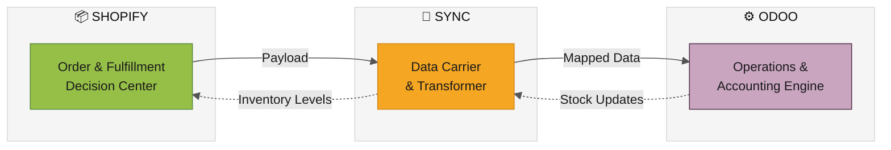

| System | Role | Owns |
|--------|------|------|
| **Shopify** | Order & Fulfillment Decision Center | Customer data, payment, location selection |
| **SYNC** | Data Carrier & Transformer | Payload mapping, field cleaning, format conversion |
| **Odoo** | Operations & Accounting Engine | Stock movements, picking, invoicing, payments |

---

## Architecture Overview

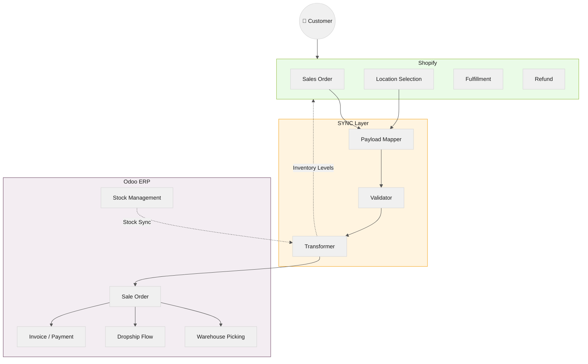

---

## Scenario 1 — Normal Warehouse Order

> A standard order where all items ship from the company's own warehouse.

### Flow

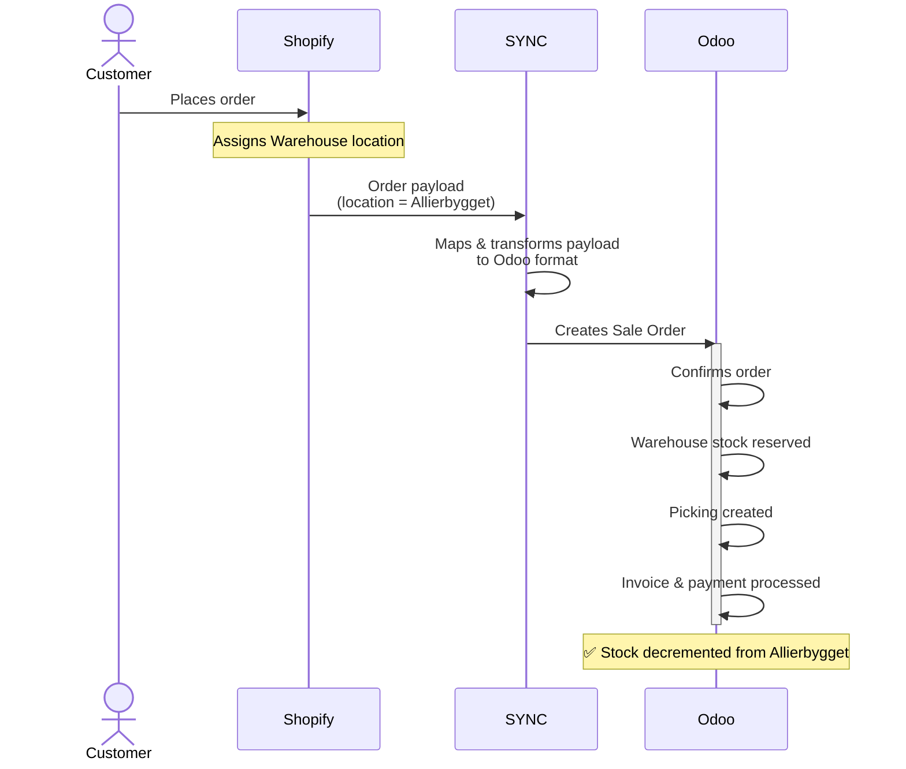

### Roles

| System | Responsibility |
|--------|---------------|
| **Shopify** | Selects Allierbygget (Bergen) location + order source of truth |
| **SYNC** | Correct field mapping & payload delivery |
| **Odoo** | Stock reservation, picking, invoicing, payment |

---

## Location Architecture — How Shopify & Odoo Locations Connect

Before diving into Dropship scenarios, it's essential to understand how locations are structured across both systems and how SYNC maps between them.

### Shopify Side: Locations

Shopify has a flat list of locations. Each represents a fulfillment point:

| Shopify Location | Purpose |
|-----------------|---------|
| **Allierbygget (Bergen)** | **Main Warehouse** — physical stock (primary) |
| **Nettlager** | **Dropship** — aggregated vendor stock |

### Odoo Side: Vendor Locations (Detailed)

Odoo maintains **per-vendor** stock locations, each with two sub-locations:

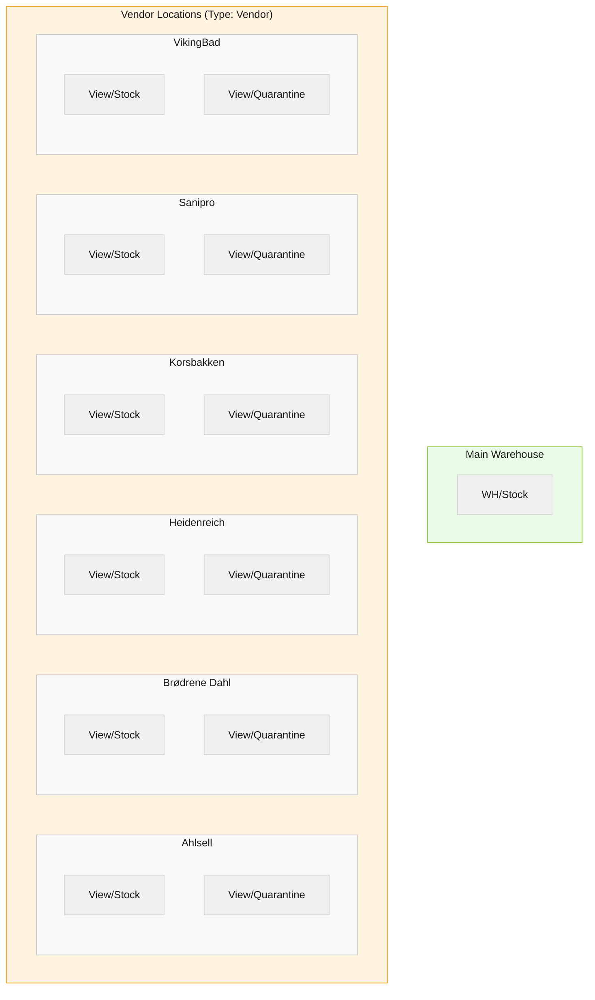

| Vendor Location | Sub-Location | Purpose |
|----------------|-------------|---------|
| **Ahlsell** | `View/Stock` | Available stock from Ahlsell |
| | `View/Quarantine` | Quarantined / reserved stock |
| **Brødrene Dahl** | `View/Stock` | Available stock from Dahl |
| | `View/Quarantine` | Quarantined stock |
| **Heidenreich** | `View/Stock` / `View/Quarantine` | Same pattern |
| **Korsbakken** | `View/Stock` / `View/Quarantine` | Same pattern |
| **Sanipro** | `View/Stock` / `View/Quarantine` | Same pattern |
| **VikingBad** | `View/Stock` / `View/Quarantine` | Same pattern |

### Shopify ↔ Odoo Location Mapping (via `sync.shopify.location`)

The mapping model supports two types:

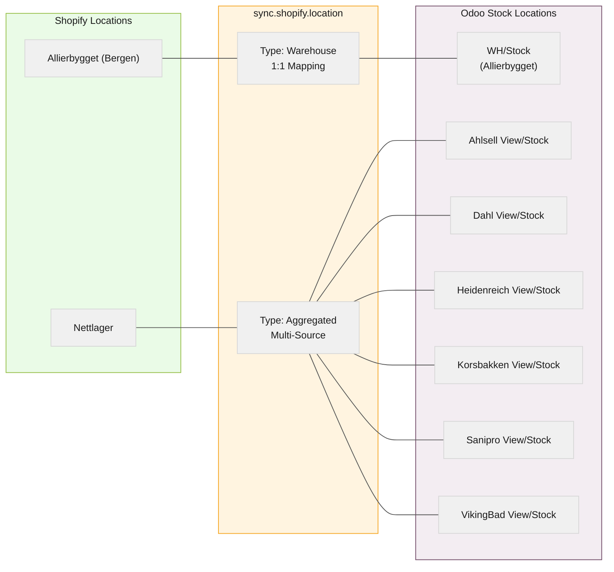

| Mapping Type | Shopify Location | Odoo Location(s) | Use Case |
|-------------|-----------------|-------------------|----------|
| **Warehouse** (1:1) | **Allierbygget (Bergen)** | WH/Stock | Main warehouse fulfillment |
| **Aggregated** (N:1) | **Nettlager** | Ahlsell, Dahl, Heidenreich, Korsbakken, Sanipro, VikingBad `View/Stock` | Combined vendor stock for Dropship |

> [!IMPORTANT]
> **Aggregated mapping** is key for Dropship: Shopify shows one "Nettlager" location, but Odoo tracks stock per-vendor separately. SYNC aggregates all vendor `View/Stock` quantities and pushes the combined total to Shopify's "Nettlager" location.

---

## Scenario 2 — Dropship Order

> The order is fulfilled directly by a vendor — no warehouse stock is touched. Odoo uses vendor-specific locations to route the Purchase Order.

### Flow

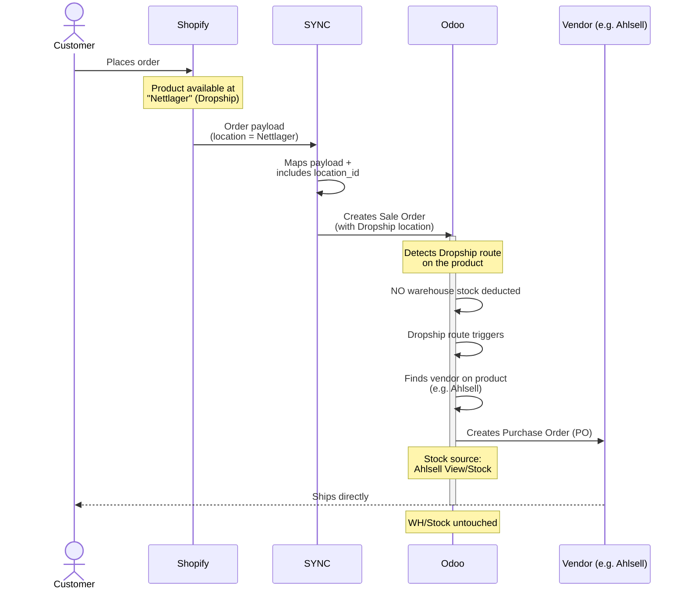

### Odoo Internal Routing (Dropship)

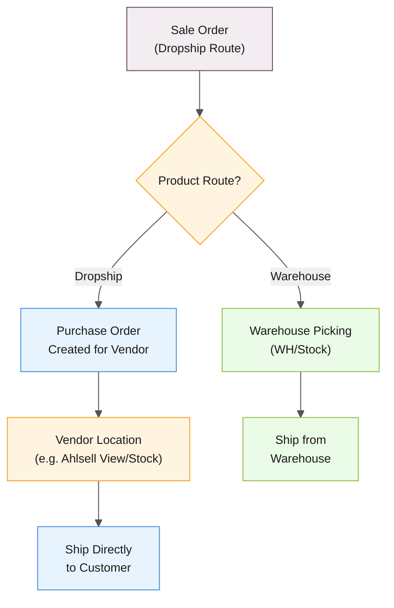

### Roles

| System | Responsibility |
|--------|---------------|
| **Shopify** | Routes to "Vendors" location based on availability |
| **SYNC** | Carries `location_id` to Odoo (critical!) |
| **Odoo** | Creates PO for specific vendor, uses vendor `View/Stock` location |

> [!CAUTION]
> If `location_id` is missing from the SYNC payload, Odoo defaults to Warehouse route — causing **incorrect stock deductions from WH/Stock** instead of triggering the vendor PO flow.

---

## Scenario 3 — Mixed Order (Warehouse + Dropship)

> A single order contains items from both the warehouse and one or more dropship vendors.

### Flow

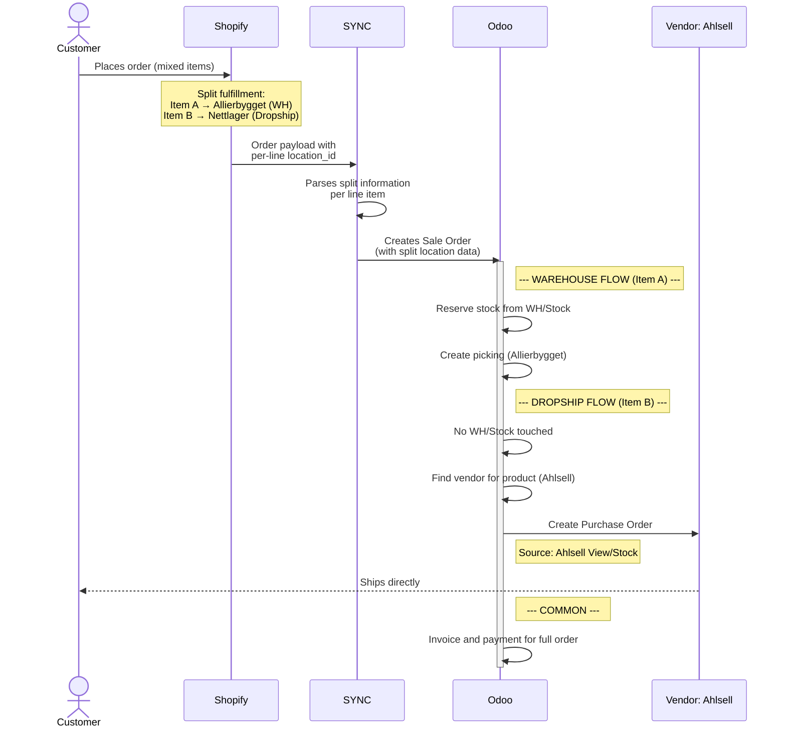

### Split Routing Detail

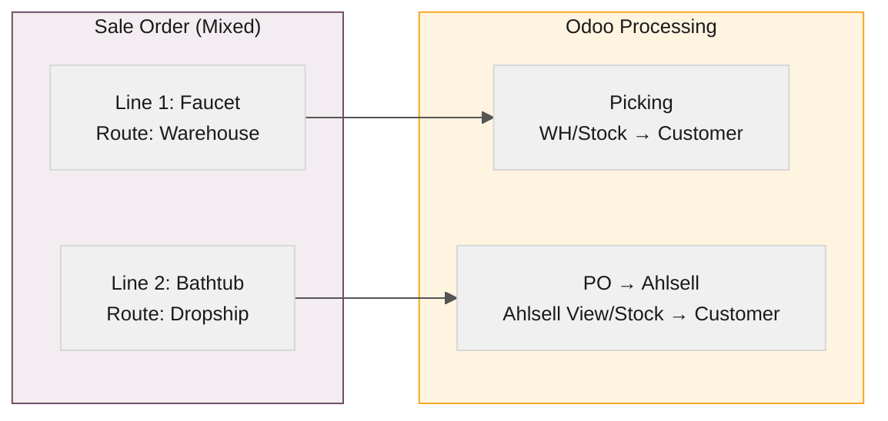

### Roles

| System | Responsibility |
|--------|---------------|
| **Shopify** | Splits fulfillment: Nettlager vs Vendors per line |
| **SYNC** | Carries per-line `location_id` values faithfully |
| **Odoo** | Routes each line: WH/Stock picking vs Vendor PO |

> [!IMPORTANT]
> The split is decided **entirely by Shopify**. SYNC must faithfully transport per-line `location_id` values. Odoo then routes each line to either `WH/Stock` (picking) or the appropriate vendor `View/Stock` (PO).

---

## Scenario 4 — Out of Stock → Backorder / Fallback

> Warehouse stock is 0, but vendor stock exists. Shopify routes to the "Nettlager" location automatically.

### Flow

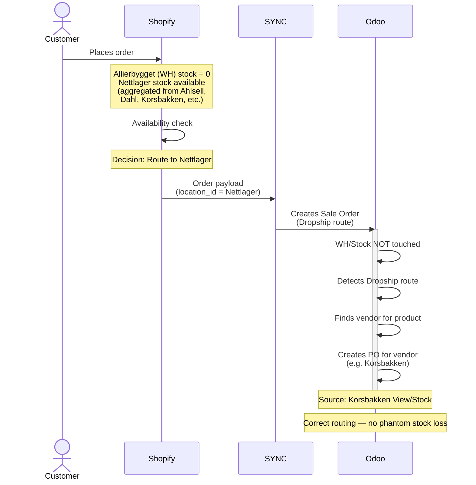

### How Stock Availability Flows Back

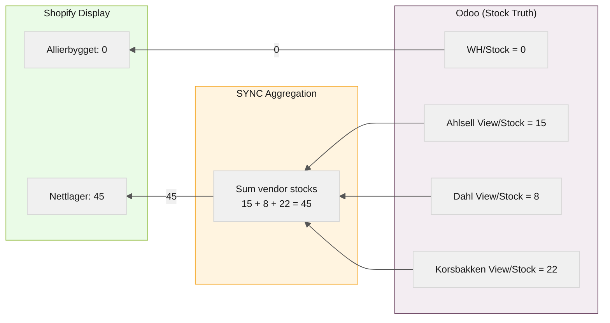

### Roles

| System | Responsibility |
|--------|---------------|
| **Shopify** | Sees aggregated vendor stock, routes to "Vendors" when WH is empty |
| **SYNC** | Aggregates per-vendor `View/Stock` → single "Vendors" quantity for Shopify |
| **Odoo** | Maintains per-vendor stock truth, executes PO for correct vendor |

> [!NOTE]
> Shopify never knows *which* vendor has stock — it only sees the aggregated "Vendors" total. Odoo determines the specific vendor (Ahlsell, Dahl, etc.) based on the product's supplier configuration when creating the Purchase Order.

---

## Scenario 5 — Refund / Return

> A refund is initiated from Shopify and needs to be reflected in Odoo's accounting.

### Flow

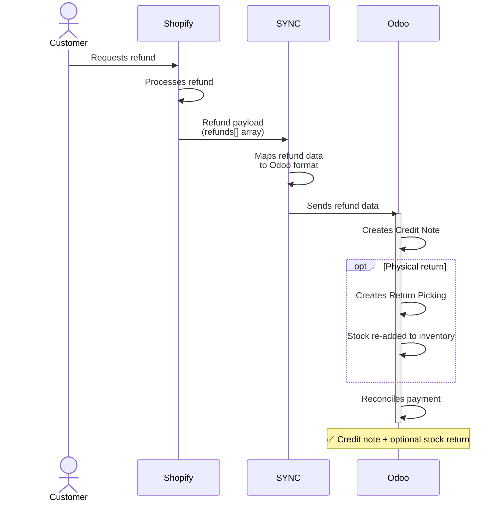

### Roles

| System | Responsibility |
|--------|---------------|
| **Shopify** | Initiates and processes the refund event |
| **SYNC** | Carries `refunds[]` payload to Odoo |
| **Odoo** | Creates credit note, optional return picking, payment reconciliation |

---

## Scenario 6 — Odoo Stock Update → Shopify

> Stock changes in Odoo (from vendors, warehouse adjustments) need to be reflected in Shopify.

### Flow

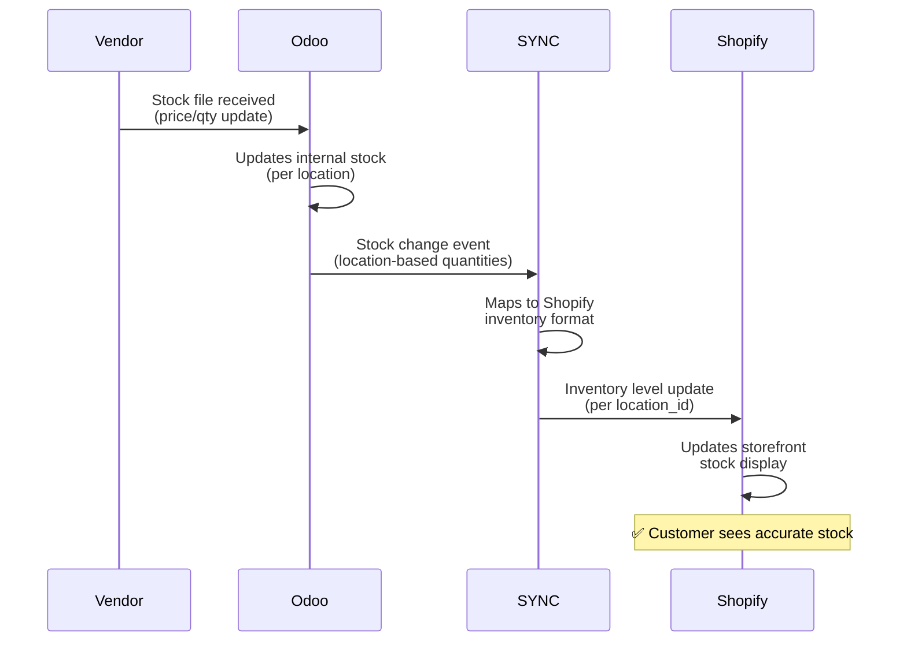

### Data Flow Direction

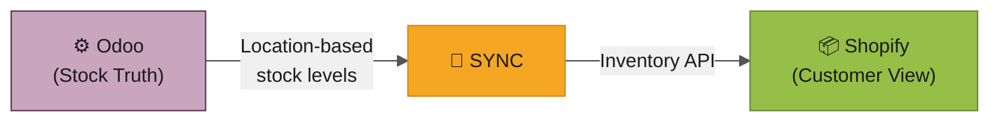

### Roles

| System | Responsibility |
|--------|---------------|
| **Odoo** | Source of truth for stock levels |
| **SYNC** | Transfers location-based stock data |
| **Shopify** | Displays stock to customer |

> [!NOTE]
> This is the **reverse flow** — Odoo → SYNC → Shopify. Odoo is the stock truth source; Shopify is the display layer.

---

## Critical Field: `location_id`

The `location_id` is the **single most important field** in the entire integration. It determines which operational path Odoo executes.

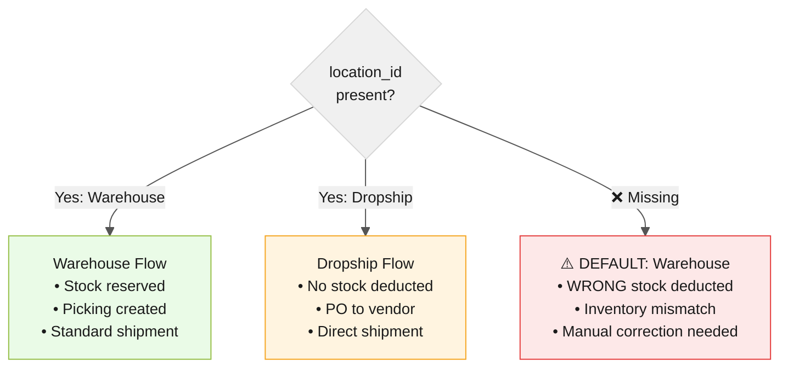

> [!CAUTION]
> **Missing `location_id` = Silent Data Corruption.**  
> Odoo will not raise an error — it will silently default to Warehouse, causing stock discrepancies that are difficult to trace after the fact.

---

## Summary Matrix

| Scenario | Shopify Decides | SYNC Carries | Odoo Executes |
|----------|----------------|-------------|---------------|
| **1. Warehouse** | Warehouse location | Mapped payload | Stock ↓ + Picking + Invoice |
| **2. Dropship** | Dropship location | `location_id` | Vendor PO (no stock ↓) |
| **3. Mixed** | Split fulfillment | Per-line locations | Parallel WH + DS flows |
| **4. Backorder** | Availability routing | Location decision | Correct flow per location |
| **5. Refund** | Refund event | `refunds[]` payload | Credit Note + Return |
| **6. Stock Sync** | Displays stock | Stock levels | Stock truth source |

---

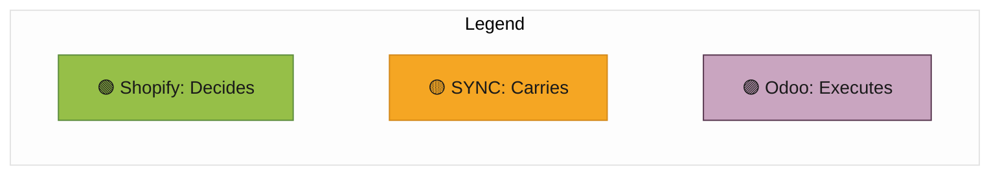

> **Golden Rule:** Shopify decides, SYNC transports, Odoo executes.  
> `location_id` is the bridge that ensures the right decision reaches the right operation.
