```mermaid
sequenceDiagram
    actor Customer
    participant Shopify
    participant SYNC
    participant Odoo

    Customer->>Shopify: Places order
    Note over Shopify: Assigns Warehouse location

    Shopify->>SYNC: Order payload<br/>(location = Warehouse)
    SYNC->>SYNC: Maps & transforms payload<br/>to Odoo format
    SYNC->>Odoo: Creates Sale Order

    activate Odoo
    Odoo->>Odoo: Confirms order
    Odoo->>Odoo: Warehouse stock reserved
    Odoo->>Odoo: Picking created
    Odoo->>Odoo: Invoice & payment processed
    deactivate Odoo

    Note over Odoo: ✅ Stock decremented from Warehouse
```

```mermaid
sequenceDiagram
    actor Customer
    participant Shopify
    participant SYNC
    participant Odoo
    participant Vendor

    Customer->>Shopify: Places order
    Note over Shopify: Assigns Dropship location

    Shopify->>SYNC: Order payload<br/>(location_id = Dropship)
    SYNC->>SYNC: Maps payload +<br/>includes location_id
    SYNC->>Odoo: Creates Sale Order<br/>(with Dropship location)

    activate Odoo
    Odoo->>Odoo: Detects Dropship location
    Odoo->>Odoo: ⚠️ NO warehouse stock deducted
    Odoo->>Odoo: Triggers Dropship flow
    Odoo->>Vendor: Creates Purchase Order (PO)
    Vendor-->>Customer: Ships directly
    deactivate Odoo

    Note over Odoo: ✅ Vendor flow active, warehouse untouched
```

```mermaid
sequenceDiagram
    actor Customer
    participant Shopify
    participant SYNC
    participant Odoo
    participant Vendor

    Customer->>Shopify: Places order<br/>(mixed items)
    Note over Shopify: Split fulfillment:<br/>Item A → Warehouse<br/>Item B → Dropship

    Shopify->>SYNC: Order payload with<br/>fulfillments[].location_id<br/>or line-level locations

    SYNC->>SYNC: Parses split information<br/>per line item
    SYNC->>Odoo: Creates Sale Order<br/>(with split location data)

    activate Odoo
    rect rgb(234, 251, 231)
        Note over Odoo: Warehouse Flow (Item A)
        Odoo->>Odoo: Reserve warehouse stock
        Odoo->>Odoo: Create picking
    end

    rect rgb(255, 244, 224)
        Note over Odoo: Dropship Flow (Item B)
        Odoo->>Odoo: No warehouse stock touched
        Odoo->>Vendor: Create Purchase Order
        Vendor-->>Customer: Ships directly
    end

    Odoo->>Odoo: Invoice & payment for full order
    deactivate Odoo
```

```mermaid
sequenceDiagram
    actor Customer
    participant Shopify
    participant SYNC
    participant Odoo

    Customer->>Shopify: Places order
    Note over Shopify: Warehouse stock = 0<br/>Dropship stock available

    Shopify->>Shopify: Availability check
    Note over Shopify: Decision: Route to Dropship

    Shopify->>SYNC: Order payload<br/>(location_id = Dropship)
    SYNC->>Odoo: Creates Sale Order<br/>(Dropship location)

    activate Odoo
    Odoo->>Odoo: ⚠️ Does NOT deduct<br/>warehouse stock
    Odoo->>Odoo: Initiates Dropship flow
    deactivate Odoo

    Note over Odoo: ✅ Correct routing — no phantom stock loss
```

# Shopify ↔ SYNC ↔ Odoo — Scenario-Based Integration Guide

> **Version:** 1.0  
> **Date:** 2026-02-10  
> **Audience:** Developers, Integration Architects, Operations Team

---

## Table of Contents

1. [Role Distribution (Core Principle)](#role-distribution)
2. [Architecture Overview](#architecture-overview)
3. [Scenario 1 — Normal Warehouse Order](#scenario-1--normal-warehouse-order)
4. [Scenario 2 — Dropship Order](#scenario-2--dropship-order)
5. [Scenario 3 — Mixed Order (Warehouse + Dropship)](#scenario-3--mixed-order-warehouse--dropship)
6. [Scenario 4 — Out of Stock → Backorder / Fallback](#scenario-4--out-of-stock--backorder--fallback)
7. [Scenario 5 — Refund / Return](#scenario-5--refund--return)
8. [Scenario 6 — Odoo Stock Update → Shopify](#scenario-6--odoo-stock-update--shopify)
9. [Critical Field: location_id](#critical-field-location_id)
10. [Summary Matrix](#summary-matrix)

---

## Role Distribution

Each system in the pipeline has a single, well-defined responsibility:

```mermaid
%%{init: {'theme': 'base', 'themeVariables': {'primaryColor': '#e8e8e8', 'primaryTextColor': '#1a1a1a', 'lineColor': '#555', 'textColor': '#1a1a1a', 'fontSize': '14px'}}}%%
graph LR
    subgraph "📦 SHOPIFY"
        S["Order & Fulfillment\nDecision Center"]
    end
    subgraph "🔄 SYNC"
        Y["Data Carrier\n& Transformer"]
    end
    subgraph "⚙️ ODOO"
        O["Operations &\nAccounting Engine"]
    end

    S -->|"Payload"| Y
    Y -->|"Mapped Data"| O
    O -.->|"Stock Updates"| Y
    Y -.->|"Inventory Levels"| S

    style S fill:#96bf48,stroke:#5e8e3e,color:#1a1a1a
    style Y fill:#f5a623,stroke:#d4891a,color:#1a1a1a
    style O fill:#c9a5c0,stroke:#5a3a52,color:#1a1a1a
```

| System | Role | Owns |
|--------|------|------|
| **Shopify** | Order & Fulfillment Decision Center | Customer data, payment, location selection |
| **SYNC** | Data Carrier & Transformer | Payload mapping, field cleaning, format conversion |
| **Odoo** | Operations & Accounting Engine | Stock movements, picking, invoicing, payments |

---

## Architecture Overview

```mermaid
%%{init: {'theme': 'base', 'themeVariables': {'primaryColor': '#f0f0f0', 'primaryTextColor': '#1a1a1a', 'lineColor': '#555', 'textColor': '#1a1a1a', 'fontSize': '14px'}}}%%
flowchart TB
    Customer(("🛒 Customer")) --> Shopify

    subgraph Shopify ["Shopify"]
        SO["Sales Order"]
        LOC["Location Selection"]
        FF["Fulfillment"]
        REF["Refund"]
    end

    subgraph SYNC ["SYNC Layer"]
        MAP["Payload Mapper"]
        VAL["Validator"]
        TRANS["Transformer"]
    end

    subgraph Odoo ["Odoo ERP"]
        OO["Sale Order"]
        WH["Warehouse Picking"]
        DS["Dropship Flow"]
        INV["Invoice / Payment"]
        STK["Stock Management"]
    end

    SO --> MAP
    LOC --> MAP
    MAP --> VAL --> TRANS --> OO
    OO --> WH
    OO --> DS
    OO --> INV
    STK -.->|"Stock Sync"| TRANS
    TRANS -.->|"Inventory Levels"| Shopify

    style Shopify fill:#eafbe7,stroke:#96bf48,color:#1a1a1a
    style SYNC fill:#fff4e0,stroke:#f5a623,color:#1a1a1a
    style Odoo fill:#f3edf2,stroke:#714b67,color:#1a1a1a
```

---

## Scenario 1 — Normal Warehouse Order

> A standard order where all items ship from the company's own warehouse.

### Flow

### Roles

| System | Responsibility |
|--------|---------------|
| **Shopify** | Selects Warehouse location + order source of truth |
| **SYNC** | Correct field mapping & payload delivery |
| **Odoo** | Stock reservation, picking, invoicing, payment |

---

## Scenario 2 — Dropship Order

> The order is fulfilled directly by a vendor — no warehouse stock is touched.

### Flow

### Roles

| System | Responsibility |
|--------|---------------|
| **Shopify** | Decides on Dropship location |
| **SYNC** | Carries `location_id` to Odoo (critical!) |
| **Odoo** | Executes Dropship / Vendor PO flow |

> [!CAUTION]
> If `location_id` is missing from the payload, Odoo defaults to Warehouse — causing **incorrect stock deductions**. This is the most common source of inventory mismatches.

---

## Scenario 3 — Mixed Order (Warehouse + Dropship)

> A single order contains items from both the warehouse and a dropship vendor.

### Flow

### Roles

| System | Responsibility |
|--------|---------------|
| **Shopify** | Makes the split fulfillment decision per line |
| **SYNC** | Carries split location data per item |
| **Odoo** | Executes parallel Warehouse + Dropship flows |

> [!IMPORTANT]
> The split is decided **entirely by Shopify**. SYNC must faithfully transport per-line `location_id` values. Odoo then routes each line accordingly.

---

## Scenario 4 — Out of Stock → Backorder / Fallback

> Warehouse stock is 0, but Dropship stock is available. Shopify routes to Dropship automatically.

### Flow

### Roles

| System | Responsibility |
|--------|---------------|
| **Shopify** | Stock availability decision — routes to available location |
| **SYNC** | Carries the routing decision (location_id) |
| **Odoo** | Executes the correct operation based on location |

> [!NOTE]
> Shopify acts as the **availability arbiter**. Odoo trusts the `location_id` it receives and executes accordingly. This prevents phantom stock deductions from empty warehouses.

---

## Scenario 5 — Refund / Return

> A refund is initiated from Shopify and needs to be reflected in Odoo's accounting.

### Flow

### Roles

| System | Responsibility |
|--------|---------------|
| **Shopify** | Initiates and processes the refund event |
| **SYNC** | Carries `refunds[]` payload to Odoo |
| **Odoo** | Creates credit note, optional return picking, payment reconciliation |

---

## Scenario 6 — Odoo Stock Update → Shopify

> Stock changes in Odoo (from vendors, warehouse adjustments) need to be reflected in Shopify.

### Flow

```mermaid
sequenceDiagram
    participant Vendor
    participant Odoo
    participant SYNC
    participant Shopify

    Vendor->>Odoo: Stock file received<br/>(price/qty update)
    Odoo->>Odoo: Updates internal stock<br/>(per location)

    Odoo->>SYNC: Stock change event<br/>(location-based quantities)
    SYNC->>SYNC: Maps to Shopify<br/>inventory format
    SYNC->>Shopify: Inventory level update<br/>(per location_id)

    Shopify->>Shopify: Updates storefront<br/>stock display

    Note over Shopify: ✅ Customer sees accurate stock
```

### Data Flow Direction

```mermaid
%%{init: {'theme': 'base', 'themeVariables': {'primaryColor': '#f0f0f0', 'primaryTextColor': '#1a1a1a', 'lineColor': '#555', 'textColor': '#1a1a1a', 'fontSize': '14px'}}}%%
flowchart LR
    Odoo["⚙️ Odoo\n(Stock Truth)"] -->|"Location-based\nstock levels"| SYNC["🔄 SYNC"]
    SYNC -->|"Inventory API"| Shopify["📦 Shopify\n(Customer View)"]

    style Odoo fill:#c9a5c0,stroke:#5a3a52,color:#1a1a1a
    style SYNC fill:#f5a623,stroke:#d4891a,color:#1a1a1a
    style Shopify fill:#96bf48,stroke:#5e8e3e,color:#1a1a1a
```

### Roles

| System | Responsibility |
|--------|---------------|
| **Odoo** | Source of truth for stock levels |
| **SYNC** | Transfers location-based stock data |
| **Shopify** | Displays stock to customer |

> [!NOTE]
> This is the **reverse flow** — Odoo → SYNC → Shopify. Odoo is the stock truth source; Shopify is the display layer.

---

## Critical Field: `location_id`

The `location_id` is the **single most important field** in the entire integration. It determines which operational path Odoo executes.

```mermaid
%%{init: {'theme': 'base', 'themeVariables': {'primaryColor': '#f0f0f0', 'primaryTextColor': '#1a1a1a', 'lineColor': '#555', 'textColor': '#1a1a1a', 'fontSize': '14px'}}}%%
flowchart TD
    LID{"location_id\npresent?"}
    
    LID -->|"Yes: Warehouse"| WH["Warehouse Flow\n• Stock reserved\n• Picking created\n• Standard shipment"]
    LID -->|"Yes: Dropship"| DS["Dropship Flow\n• No stock deducted\n• PO to vendor\n• Direct shipment"]
    LID -->|"❌ Missing"| ERR["⚠️ DEFAULT: Warehouse\n• WRONG stock deducted\n• Inventory mismatch\n• Manual correction needed"]

    style WH fill:#eafbe7,stroke:#96bf48,color:#1a1a1a
    style DS fill:#fff4e0,stroke:#f5a623,color:#1a1a1a
    style ERR fill:#fde8e8,stroke:#e53e3e,color:#1a1a1a
```

> [!CAUTION]
> **Missing `location_id` = Silent Data Corruption.**  
> Odoo will not raise an error — it will silently default to Warehouse, causing stock discrepancies that are difficult to trace after the fact.

---

## Summary Matrix

| Scenario | Shopify Decides | SYNC Carries | Odoo Executes |
|----------|----------------|-------------|---------------|
| **1. Warehouse** | Warehouse location | Mapped payload | Stock ↓ + Picking + Invoice |
| **2. Dropship** | Dropship location | `location_id` | Vendor PO (no stock ↓) |
| **3. Mixed** | Split fulfillment | Per-line locations | Parallel WH + DS flows |
| **4. Backorder** | Availability routing | Location decision | Correct flow per location |
| **5. Refund** | Refund event | `refunds[]` payload | Credit Note + Return |
| **6. Stock Sync** | Displays stock | Stock levels | Stock truth source |

---

```mermaid
%%{init: {'theme': 'base', 'themeVariables': {'primaryColor': '#f0f0f0', 'primaryTextColor': '#1a1a1a', 'lineColor': '#555', 'textColor': '#1a1a1a', 'fontSize': '14px'}}}%%
graph TB
    subgraph Legend
        direction LR
        A["🟢 Shopify: Decides"] ~~~ B["🟡 SYNC: Carries"] ~~~ C["🟣 Odoo: Executes"]
    end

    style A fill:#96bf48,stroke:#5e8e3e,color:#1a1a1a
    style B fill:#f5a623,stroke:#d4891a,color:#1a1a1a
    style C fill:#c9a5c0,stroke:#5a3a52,color:#1a1a1a
```

> **Golden Rule:** Shopify decides, SYNC transports, Odoo executes.  
> `location_id` is the bridge that ensures the right decision reaches the right operation.
