# Shopify ↔ SYNC ↔ Odoo — Scenario-Based Integration Guide

> **Version:** 1.2  
> **Date:** 2026-02-27  
> **Audience:** Developers, Integration Architects, Operations Team

---

## Table of Contents

1. [Role Distribution (Core Principle)](#role-distribution)
2. [Architecture Overview](#architecture-overview)
3. [Scenario 1 — Normal Warehouse Order](#scenario-1--normal-warehouse-order)
4. [Scenario 2 — Dropship Order](#scenario-2--dropship-order)
5. [Scenario 3 — Mixed Order (Warehouse + Dropship)](#scenario-3--mixed-order-warehouse--dropship)
6. [Scenario 4 — Out of Stock → Backorder / Fallback](#scenario-4--out-of-stock--backorder--fallback)
7. [Scenario 5 — Refund / Return](#scenario-5--refund--return)
8. [Scenario 6 — Odoo Stock Update → Shopify](#scenario-6--odoo-stock-update--shopify)
9. [Critical Field: location_id](#critical-field-location_id)
10. [Summary Matrix](#summary-matrix)

---

## Role Distribution

Each system in the pipeline has a single, well-defined responsibility:

```mermaid
%%{init: {'theme': 'base', 'themeVariables': {'primaryColor': '#e8e8e8', 'primaryTextColor': '#1a1a1a', 'lineColor': '#555', 'textColor': '#1a1a1a', 'fontSize': '14px'}}}%%
graph LR
    subgraph "📦 SHOPIFY"
        S["Order & Fulfillment\nDecision Center"]
    end
    subgraph "🔄 SYNC"
        Y["Data Carrier\n& Transformer"]
    end
    subgraph "⚙️ ODOO"
        O["Operations &\nAccounting Engine"]
    end

    S -->|"Payload"| Y
    Y -->|"Mapped Data"| O
    O -.->|"Stock Updates"| Y
    Y -.->|"Inventory Levels"| S

    style S fill:#96bf48,stroke:#5e8e3e,color:#1a1a1a
    style Y fill:#f5a623,stroke:#d4891a,color:#1a1a1a
    style O fill:#c9a5c0,stroke:#5a3a52,color:#1a1a1a
```

| System | Role | Owns |
|--------|------|------|
| **Shopify** | Order & Fulfillment Decision Center | Customer data, payment, location selection |
| **SYNC** | Data Carrier | Payload delivery, format conversion (Pass-through) |
| **Odoo** | Mapping Engine & Operations | Location mapping (`sync.shopify.location`), stock moves, routing, invoicing |

---

## Architecture Overview

```mermaid
%%{init: {'theme': 'base', 'themeVariables': {'primaryColor': '#f0f0f0', 'primaryTextColor': '#1a1a1a', 'lineColor': '#555', 'textColor': '#1a1a1a', 'fontSize': '14px'}}}%%
flowchart TB
    Customer(("🛒 Customer")) --> Shopify

    subgraph Shopify ["Shopify"]
        SO["Sales Order"]
        LOC["Location Selection"]
        FF["Fulfillment"]
        REF["Refund"]
    end

    subgraph SYNC ["SYNC Layer"]
        MAP["Payload Mapper"]
        VAL["Validator"]
        TRANS["Transformer"]
    end

    subgraph Odoo ["Odoo ERP"]
        OO["Sale Order"]
        WH["W0002 Picking"]
        DS["Dropship Flow"]
        INV["Invoice / Payment"]
        STK["Stock Management"]
    end

    SO --> MAP
    LOC --> MAP
    MAP --> VAL --> TRANS --> OO
    OO --> WH
    OO --> DS
    OO --> INV
    STK -.->|"Stock Sync"| TRANS
    TRANS -.->|"Inventory Levels"| Shopify

    style Shopify fill:#eafbe7,stroke:#96bf48,color:#1a1a1a
    style SYNC fill:#fff4e0,stroke:#f5a623,color:#1a1a1a
    style Odoo fill:#f3edf2,stroke:#714b67,color:#1a1a1a
```

---

## Scenario 1 — Normal Warehouse Order

> A standard order where all items ship from the company's own warehouse.

### Flow

```mermaid
sequenceDiagram
    actor Customer
    participant Shopify
    participant SYNC
    participant Odoo

    Customer->>Shopify: Places order
    Note over Shopify: Assigns Warehouse location

    Shopify->>SYNC: Order payload<br/>(location = Allierbygget)
    SYNC->>SYNC: Maps & transforms payload<br/>to Odoo format
    SYNC->>Odoo: Creates Sale Order

    activate Odoo
    Odoo->>Odoo: Confirms order
    Odoo->>Odoo: Warehouse stock reserved
    Odoo->>Odoo: Picking created
    Odoo->>Odoo: Invoice & payment processed (if workflow enabled)
    deactivate Odoo

    Note over Odoo: ✅ Stock decremented from Allierbygget
```

### Roles

| System | Responsibility |
|--------|---------------|
| **Shopify** | Selects Allierbygget (Bergen) location + order source of truth |
| **SYNC** | Correct field mapping & payload delivery |
| **Odoo** | Stock reservation, picking, invoicing (and payment if workflow enabled) |

> [!NOTE]
> Invoicing/payment automation depends on configured workflow policies, not only on location.

---

## Location Architecture — How Shopify & Odoo Locations Connect

Before diving into Dropship scenarios, it's essential to understand how locations are structured across both systems and how SYNC maps between them.

### Shopify Side: Locations

Shopify has a flat list of locations. Each represents a fulfillment point:

| Shopify Location | Purpose |
|-----------------|---------|
| **Allierbygget (Bergen)** | **Main Warehouse** — physical stock (primary) |
| **Nettlager** | **Dropship pool** — aggregated vendor stock for direct vendor shipment |

### Odoo Side: Vendor Locations (Detailed)

Odoo maintains **per-vendor** stock locations, each with two sub-locations:

```mermaid
%%{init: {'theme': 'base', 'themeVariables': {'primaryColor': '#f0f0f0', 'primaryTextColor': '#1a1a1a', 'lineColor': '#555', 'textColor': '#1a1a1a', 'fontSize': '13px'}}}%%
flowchart TB
    subgraph WH ["Main Warehouse (W0002)"]
        WHS["W0002/Stock"]
    end

    subgraph VendorLocations ["Vendor Locations (Type: Vendor)"]
        subgraph Ahlsell ["Ahlsell"]
            AS["View/Stock"]
            AQ["View/Quarantine"]
        end
        subgraph Dahl ["Brødrene Dahl"]
            DS["View/Stock"]
            DQ["View/Quarantine"]
        end
        subgraph Heidenreich ["Heidenreich"]
            HS["View/Stock"]
            HQ["View/Quarantine"]
        end
        subgraph Korsbakken ["Korsbakken"]
            KS["View/Stock"]
            KQ["View/Quarantine"]
        end
        subgraph Sanipro ["Sanipro"]
            SS["View/Stock"]
            SQ["View/Quarantine"]
        end
        subgraph VikingBad ["VikingBad"]
            VS["View/Stock"]
            VQ["View/Quarantine"]
        end
    end

    style WH fill:#eafbe7,stroke:#96bf48,color:#1a1a1a
    style VendorLocations fill:#fff4e0,stroke:#f5a623,color:#1a1a1a
    style Ahlsell fill:#f9f9f9,stroke:#ccc,color:#1a1a1a
    style Dahl fill:#f9f9f9,stroke:#ccc,color:#1a1a1a
    style Heidenreich fill:#f9f9f9,stroke:#ccc,color:#1a1a1a
    style Korsbakken fill:#f9f9f9,stroke:#ccc,color:#1a1a1a
    style Sanipro fill:#f9f9f9,stroke:#ccc,color:#1a1a1a
    style VikingBad fill:#f9f9f9,stroke:#ccc,color:#1a1a1a
```

| Vendor Location | Sub-Location | Purpose |
|----------------|-------------|---------|
| **Ahlsell** | `View/Stock` | Available stock from Ahlsell |
| | `View/Quarantine` | Quarantined / reserved stock |
| **Brødrene Dahl** | `View/Stock` | Available stock from Dahl |
| | `View/Quarantine` | Quarantined stock |
| **Heidenreich** | `View/Stock` / `View/Quarantine` | Same pattern |
| **Korsbakken** | `View/Stock` / `View/Quarantine` | Same pattern |
| **Sanipro** | `View/Stock` / `View/Quarantine` | Same pattern |
| **VikingBad** | `View/Stock` / `View/Quarantine` | Same pattern |

### Shopify ↔ Odoo Location Mapping (Handled in Odoo via `sync.shopify.location`)

> [!NOTE]
> **Mapping Logic:** The mapping configuration resides entirely within Odoo. SYNC passes Shopify location identifiers, and Odoo resolves the mapped location context (`warehouse` or `aggregated`) for routing/stock sync decisions.

The mapping model supports two types:

| Mapping Type | Shopify Location | Odoo Location(s) | Use Case |
|-------------|-----------------|-------------------|----------|
| **Warehouse** (1:1) | **Allierbygget (Bergen)** | W0002/Stock | Main warehouse fulfillment |
| **Aggregated** (N:1) | **Nettlager** | Ahlsell, Dahl, Heidenreich, Korsbakken, Sanipro, VikingBad `View/Stock` | Combined vendor stock for Dropship |

> [!IMPORTANT]
> **Aggregated mapping** is key for Dropship: Shopify shows one "Nettlager" location, but Odoo tracks stock per-vendor separately. SYNC aggregates all vendor `View/Stock` quantities and pushes the combined total to Shopify's "Nettlager" location.  
> **Scope boundary:** Nettlager is for direct Dropship flow (vendor → customer). It is **not** the fallback target for Main Warehouse backorders.

---

## Scenario 2 — Dropship Order

> This scenario describes the **dropship branch**: a line is fulfilled directly by vendor when the decision engine selects Dropship (typically non-C&C + W0002 free stock shortage on a dropship-capable line).

### Flow

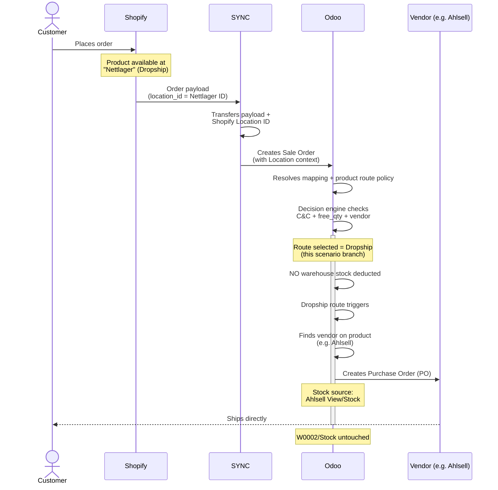

### Odoo Internal Routing (Dropship)

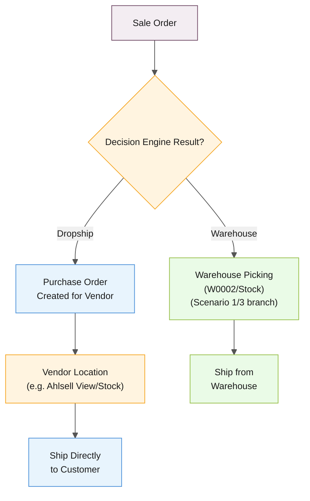

### Roles

| System | Responsibility |
|--------|---------------|
| **Shopify** | Sends fulfillment intent/location context (e.g., Nettlager for dropship candidate lines) |
| **SYNC** | Carries `location_id` to Odoo (critical!) |
| **Odoo** | Makes final line-level route decision and, for this branch, creates vendor PO from vendor `View/Stock` |

> [!CAUTION]
> If `location_id` is missing or wrong, and product route policy is not strict dropship, Odoo can drift into the wrong operational path (for example warehouse flow), causing stock/fulfillment mismatches.

> [!NOTE]
> Scenario 2 is not "all dropship-capable products always dropship."  
> The same product can still follow warehouse branch when W0002 has sufficient free stock, or when Click & Collect forces warehouse flow.

---

## Scenario 3 — Mixed Order (Warehouse + Dropship)

> A single order contains items from both the warehouse and one or more dropship vendors.

### Flow

```mermaid
sequenceDiagram
    actor Customer
    participant Shopify
    participant SYNC
    participant Odoo
    participant Ahlsell as Vendor: Ahlsell

    Customer->>Shopify: Places order (mixed items)
    Note over Shopify: Split fulfillment:<br/>Item A → Allierbygget (W0002)<br/>Item B → Nettlager (Dropship)

    Shopify->>SYNC: Order payload with<br/>mixed fulfillment context

    SYNC->>SYNC: Passes location + route context
    SYNC->>Odoo: Creates Sale Order
    Odoo->>Odoo: Applies location mapping + product routes

    activate Odoo
    Note right of Odoo: --- WAREHOUSE FLOW (Item A) ---
    Odoo->>Odoo: Reserve stock from W0002/Stock
    Odoo->>Odoo: Create picking (Allierbygget)
    Odoo->>Odoo: Pick/pack/ship Item A from W0002
    Note right of Odoo: If W0002 shortage exists for Item A,<br/>Item A follows Scenario 4 backorder flow

    Note right of Odoo: --- DROPSHIP FLOW (Item B) ---
    Odoo->>Odoo: No W0002/Stock touched
    Odoo->>Odoo: Find vendor for product (Ahlsell)
    Odoo->>Ahlsell: Create Purchase Order
    Note right of Odoo: Source: Ahlsell View/Stock
    Ahlsell-->>Customer: Ships directly

    Note right of Odoo: --- COMMON ---
    Odoo->>Odoo: Invoice and payment for full order (according to workflow settings)
    deactivate Odoo
```

### Split Routing Detail

```mermaid
%%{init: {'theme': 'base', 'themeVariables': {'primaryColor': '#f0f0f0', 'primaryTextColor': '#1a1a1a', 'lineColor': '#555', 'textColor': '#1a1a1a', 'fontSize': '13px'}}}%%
flowchart LR
    subgraph Order ["Sale Order (Mixed)"]
        L1["Line 1: Faucet\nRoute: Warehouse"]
        L2["Line 2: Bathtub\nRoute: Dropship"]
    end

    subgraph Processing ["Odoo Processing"]
        P1["Picking + Ship\nW0002/Stock → Customer\n(or Scenario 4 backorder if shortage)"]
        P2["PO → Ahlsell\nAhlsell View/Stock → Customer"]
    end

    L1 --> P1
    L2 --> P2

    style Order fill:#f3edf2,stroke:#714b67,color:#1a1a1a
    style Processing fill:#fff4e0,stroke:#f5a623,color:#1a1a1a
```

### Roles

| System | Responsibility |
|--------|---------------|
| **Shopify** | Provides mixed fulfillment intent (warehouse + dropship) |
| **SYNC** | Carries location/routing context to Odoo |
| **Odoo** | Executes per-line flow via product routes: W0002 picking/shipment vs Vendor PO |

> [!IMPORTANT]
> For mixed orders, `location_id` helps determine warehouse context, but line-level execution in Odoo is still driven by product routes and vendor configuration. Do not assume per-line `location_id` routing unless explicitly implemented end-to-end.

> [!NOTE]
> Mixed orders can legitimately create multiple operational documents (for example one warehouse delivery + one vendor PO). This is expected behavior.

---

## Scenario 4 — Out of Stock → Backorder / Fallback

> Main Warehouse stock is 0. Order remains on Main Warehouse and is fulfilled through backorder (PO to warehouse, then pick/pack/ship).

> [!NOTE]
> The same warehouse-first backorder principle also applies to Click & Collect lines: no dropship fallback, replenishment goes to W0002 first.

### Flow

```mermaid
sequenceDiagram
    actor Customer
    participant Shopify
    participant SYNC
    participant Odoo

    Customer->>Shopify: Places order

    Note over Shopify: Allierbygget (W0002) stock = 0<br/>Backorder policy allows checkout

    Shopify->>Shopify: Availability check
    Note over Shopify: Decision: Keep Main Warehouse<br/>(do not reroute to Nettlager)

    Shopify->>SYNC: Order payload<br/>(location_id = Allierbygget)
    SYNC->>Odoo: Creates Sale Order<br/>(Main Warehouse context)

    activate Odoo
    Odoo->>Odoo: Reservation fails/partial (W0002 stock = 0)
    Odoo->>Odoo: Creates RFQ/PO for replenishment
    Odoo->>Vendor: PO destination = Main Warehouse (W0002/IN)
    Vendor-->>Odoo: Deliver to warehouse
    Odoo->>Odoo: Receive PO, allocate to waiting SO/backorder
    alt Standard delivery
        Odoo->>Odoo: Pick/pack/ship from Main Warehouse to customer
    else Click & Collect
        Odoo->>Odoo: Stage for pickup in W0002 C&C flow
        Customer-->>Odoo: Picks up in store
    end
    deactivate Odoo

    Note over Odoo: Correct backorder path — PO goes to warehouse first
```

### How Stock Availability Flows Back

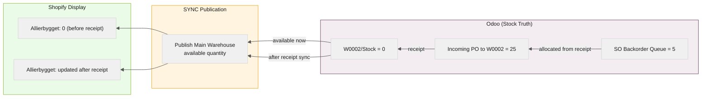

### Roles

| System | Responsibility |
|--------|---------------|
| **Shopify** | Keeps Main Warehouse location for backorderable items |
| **SYNC** | Carries Main Warehouse location + order payload |
| **Odoo** | Executes backorder: PO to warehouse, receipt, allocation, shipment |

> [!NOTE]
> `Nettlager` is still valid for **direct dropship scenarios** (Scenario 2/3).  
> For **Main Warehouse backorder**, routing to Nettlager is a policy error because it bypasses warehouse receipt and packaging.

---

## Scenario 5 — Refund / Return

> A refund is initiated from Shopify and needs to be reflected in Odoo's accounting.

### Flow

```mermaid
sequenceDiagram
    actor Customer
    participant Shopify
    participant SYNC
    participant Odoo

    Customer->>Shopify: Requests refund
    Shopify->>Shopify: Processes refund

    Shopify->>SYNC: Refund payload<br/>(refunds[] array)
    SYNC->>SYNC: Maps refund data<br/>to Odoo format
    SYNC->>Odoo: Sends refund data

    activate Odoo
    Odoo->>Odoo: Creates Credit Note
    
    opt Physical return
        Odoo->>Odoo: Creates Return Picking (current default: to W0002)
        Odoo->>Odoo: Stock re-added to W0002 inventory
    end

    Odoo->>Odoo: Reconciles payment (if refund payment registration is enabled)
    deactivate Odoo

    Note over Odoo: ✅ Credit note + optional stock return
```

### Roles

| System | Responsibility |
|--------|---------------|
| **Shopify** | Initiates and processes the refund event |
| **SYNC** | Carries `refunds[]` payload to Odoo |
| **Odoo** | Creates credit note, optional return picking (default destination: W0002), optional payment reconciliation |

> [!NOTE]
> Default config is typically: Auto-Refund = enabled, Auto-Return = disabled, Register Payment for Credit Note = disabled.

> [!IMPORTANT]
> Return destination policy is currently warehouse-first (W0002).  
> Direct customer-to-vendor return is not enabled by default and requires separate ops approval/SOP.

---

## Scenario 6 — Odoo Stock Update → Shopify

> Stock changes in Odoo (from vendors, warehouse adjustments) need to be reflected in Shopify.

### Flow

```mermaid
sequenceDiagram
    participant Vendor
    participant Odoo
    participant SYNC
    participant Shopify

    Vendor->>Odoo: Stock file received<br/>(price/qty update)
    Odoo->>Odoo: Updates internal stock<br/>(per location)

    Odoo->>SYNC: Stock change event<br/>(location-based quantities)
    SYNC->>SYNC: Maps to Shopify<br/>inventory format
    SYNC->>Shopify: Inventory level update<br/>(per location_id)

    Shopify->>Shopify: Updates storefront<br/>stock display

    Note over Shopify: ✅ Customer sees accurate stock
```

### Data Flow Direction

```mermaid
%%{init: {'theme': 'base', 'themeVariables': {'primaryColor': '#f0f0f0', 'primaryTextColor': '#1a1a1a', 'lineColor': '#555', 'textColor': '#1a1a1a', 'fontSize': '14px'}}}%%
flowchart LR
    Odoo["⚙️ Odoo\n(Stock Truth)"] -->|"Location-based\nstock levels"| SYNC["🔄 SYNC"]
    SYNC -->|"Inventory API"| Shopify["📦 Shopify\n(Customer View)"]

    style Odoo fill:#c9a5c0,stroke:#5a3a52,color:#1a1a1a
    style SYNC fill:#f5a623,stroke:#d4891a,color:#1a1a1a
    style Shopify fill:#96bf48,stroke:#5e8e3e,color:#1a1a1a
```

### Roles

| System | Responsibility |
|--------|---------------|
| **Odoo** | Source of truth for stock levels |
| **SYNC** | Transfers location-based stock data |
| **Shopify** | Displays stock to customer |

> [!NOTE]
> This is the **reverse flow** — Odoo → SYNC → Shopify. Odoo is the stock truth source; Shopify is the display layer.

---

## Critical Field: `location_id`

`location_id` is a critical routing input, but not the only one.  
In Odoo, final execution is determined by `location_id` **plus** fulfillment policy (for example C&C override), product routes (`Buy`, `MTO`, `Dropship`), `free_qty`, and vendor setup.

```mermaid
%%{init: {'theme': 'base', 'themeVariables': {'primaryColor': '#f0f0f0', 'primaryTextColor': '#1a1a1a', 'lineColor': '#555', 'textColor': '#1a1a1a', 'fontSize': '14px'}}}%%
flowchart TD
    LID{"location_id\nmapped?"}
    
    LID -->|"Yes"| ROUTE{"Product Route + Policy?"}
    ROUTE -->|"Warehouse + Buy/MTO"| WH["Backorder/Warehouse Flow\n• Wait/partial reserve\n• PO to Main Warehouse (W0002)\n• Receive → allocate → ship"]
    ROUTE -->|"Dropship"| DS["Dropship Flow\n• No W0002 stock deduction\n• PO to vendor\n• Direct shipment"]
    LID -->|"❌ No"| ERR["⚠️ Routing risk\n• Wrong warehouse context\n• Wrong PO destination\n• Manual correction needed"]

    style WH fill:#eafbe7,stroke:#96bf48,color:#1a1a1a
    style DS fill:#fff4e0,stroke:#f5a623,color:#1a1a1a
    style ERR fill:#fde8e8,stroke:#e53e3e,color:#1a1a1a
```

> [!CAUTION]
> **Missing/wrong `location_id` + wrong route config = silent operational drift.**  
> Symptoms: wrong warehouse context, incorrect PO destination, or stock discrepancies discovered late.

---

## Summary Matrix

| Scenario | Shopify Decides | SYNC Carries | Odoo Executes |
|----------|----------------|-------------|---------------|
| **1. Warehouse** | Warehouse location | Mapped payload | Stock ↓ + Picking + Invoice |
| **2. Dropship** | Dropship intent/location | `location_id` | Vendor PO only when dropship branch is selected (no W0002 stock ↓) |
| **3. Mixed** | Mixed intent (W0002 + Dropship) | Location + route context | Parallel W0002 + DS flows (route-driven) |
| **4. Backorder** | Backorder accepted on Main Warehouse (W0002) | Main Warehouse (W0002) location + order data | PO to W0002 → receipt → allocate backorder → ship |
| **5. Refund** | Refund event | `refunds[]` payload | Credit Note + optional Return to W0002 (current default) (+ optional payment registration) |
| **6. Stock Sync** | Displays stock | Stock levels | Stock truth source |

---

```mermaid
%%{init: {'theme': 'base', 'themeVariables': {'primaryColor': '#f0f0f0', 'primaryTextColor': '#1a1a1a', 'lineColor': '#555', 'textColor': '#1a1a1a', 'fontSize': '14px'}}}%%
graph TB
    subgraph Legend
        direction LR
        A["🟢 Shopify: Decides"] ~~~ B["🟡 SYNC: Carries"] ~~~ C["🟣 Odoo: Executes"]
    end

    style A fill:#96bf48,stroke:#5e8e3e,color:#1a1a1a
    style B fill:#f5a623,stroke:#d4891a,color:#1a1a1a
    style C fill:#c9a5c0,stroke:#5a3a52,color:#1a1a1a
```

> **Golden Rule:** Shopify decides, SYNC transports, Odoo executes.  
> `location_id` + product routes together ensure the right decision reaches the right operation.
